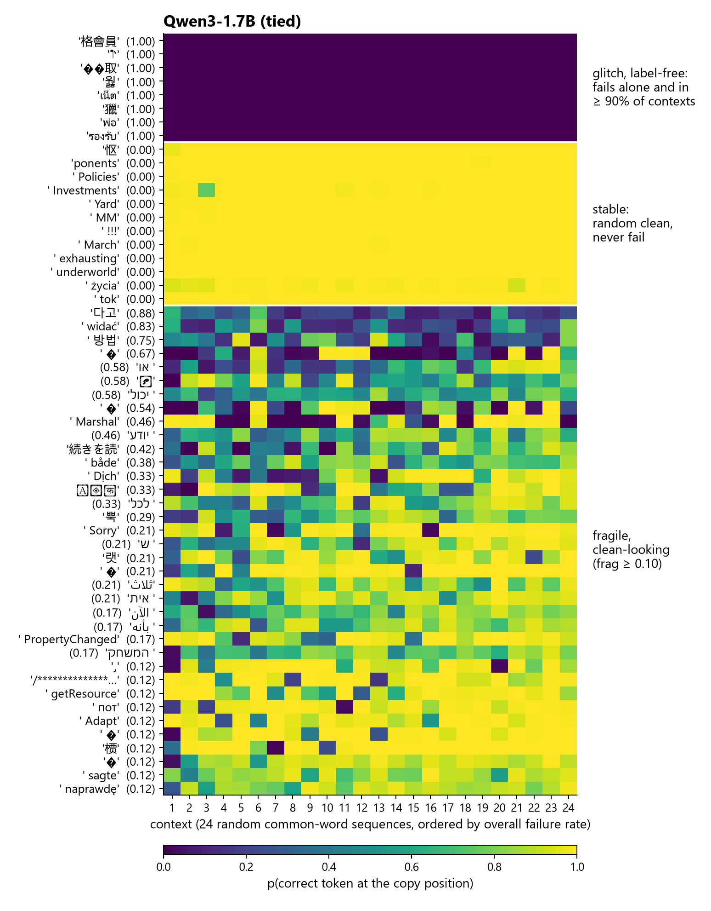
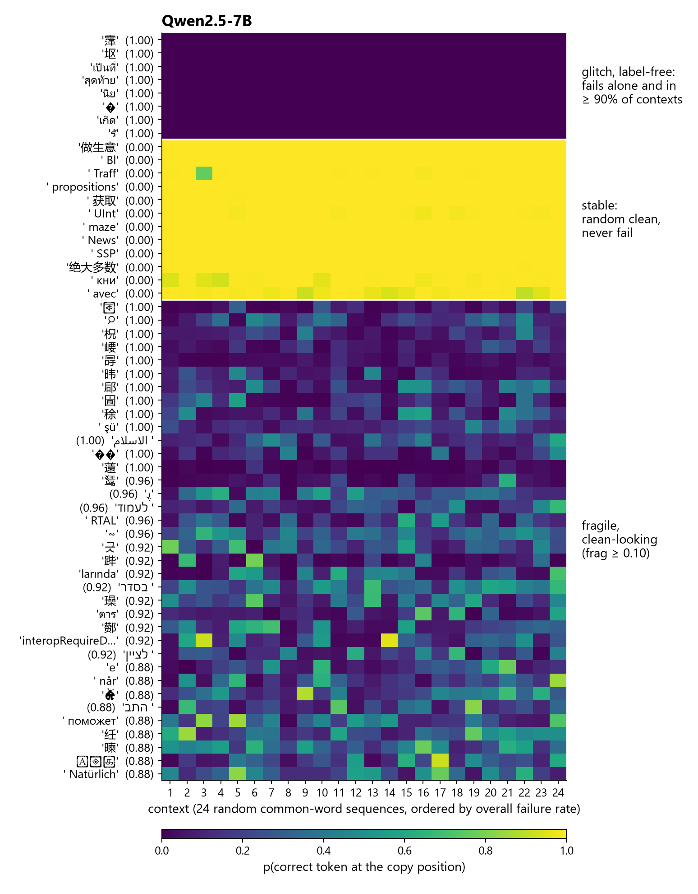
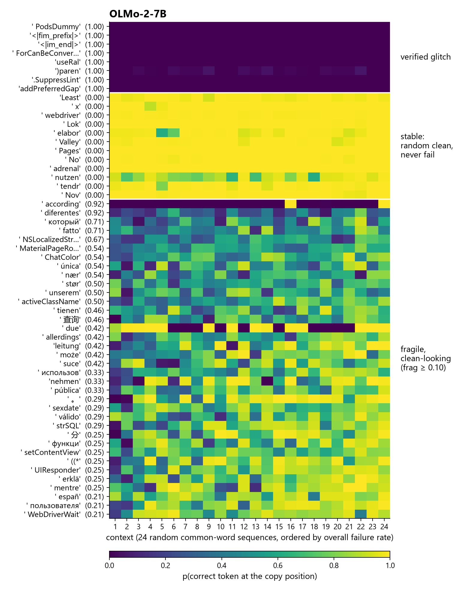
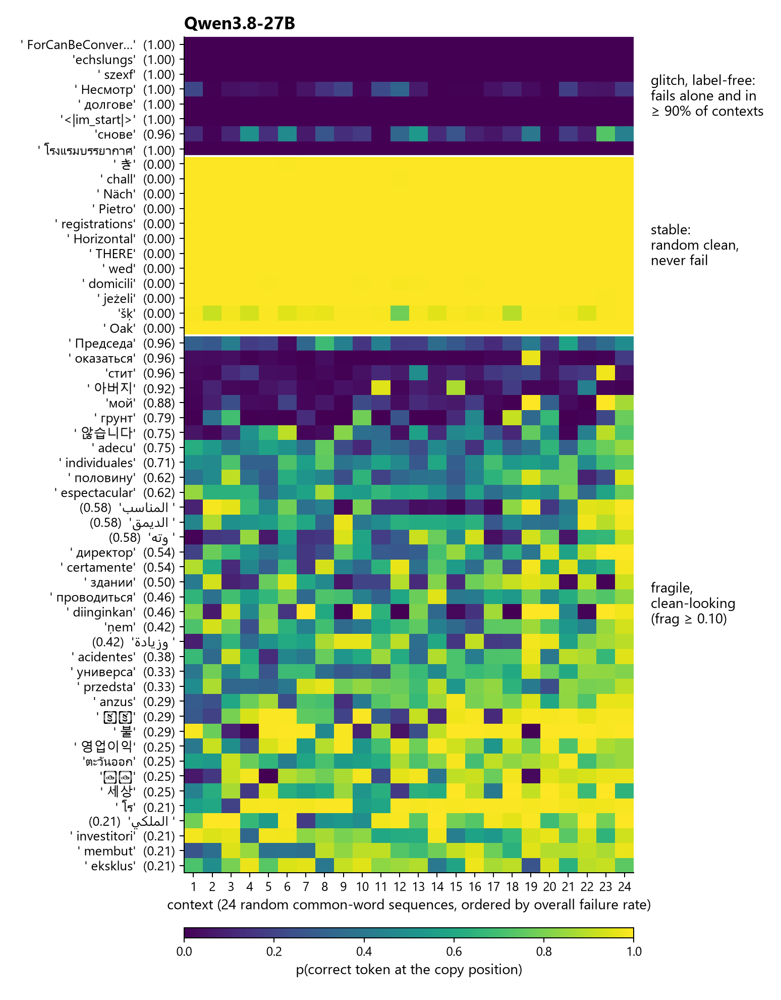
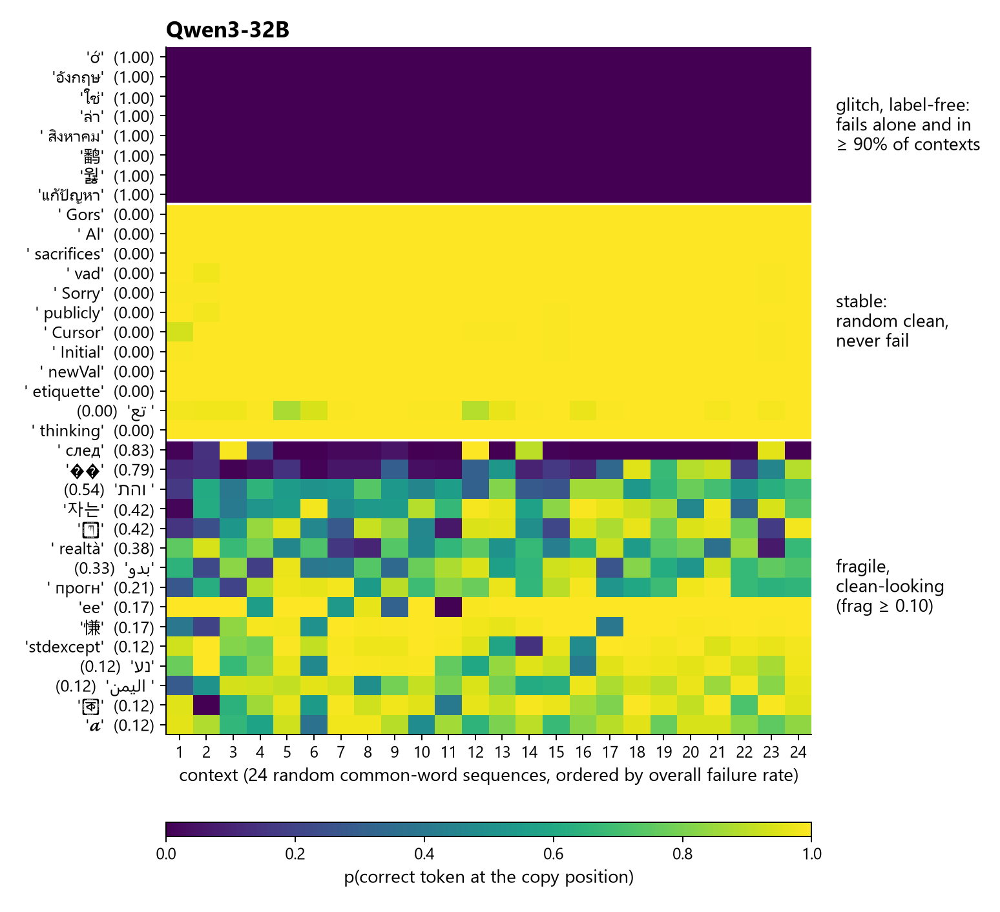
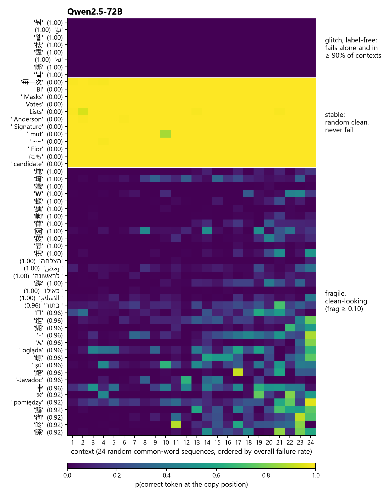
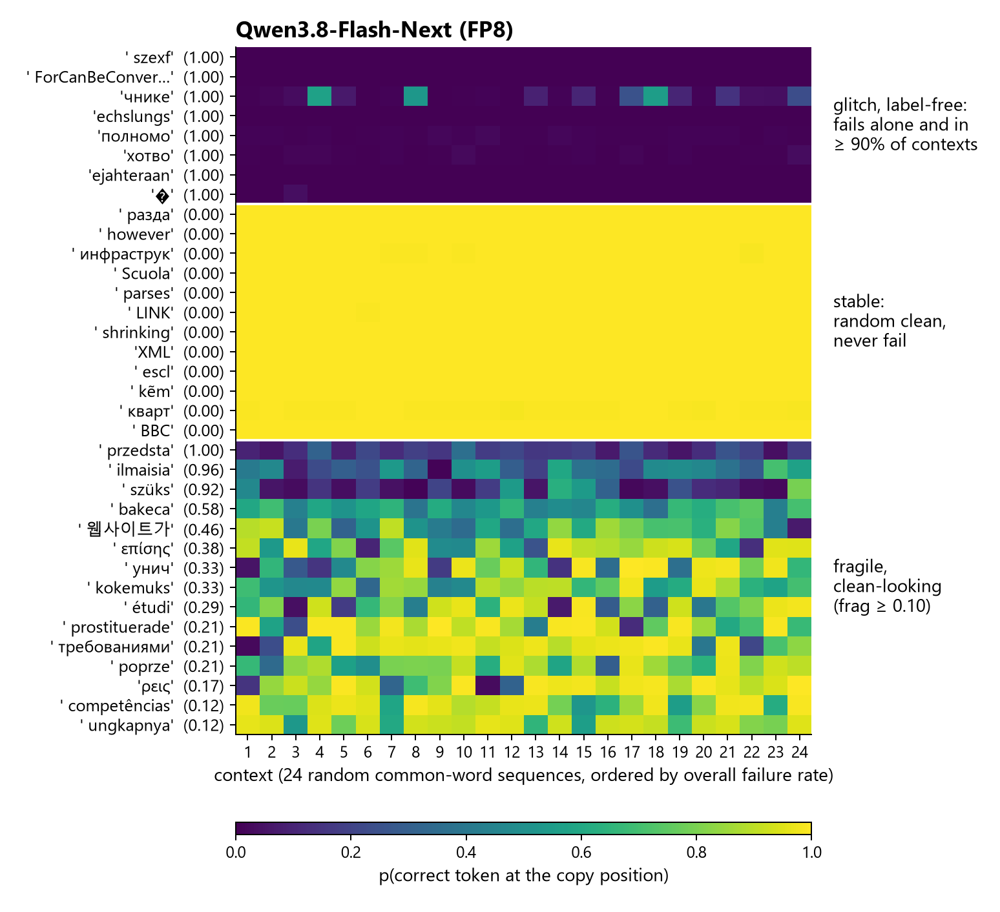
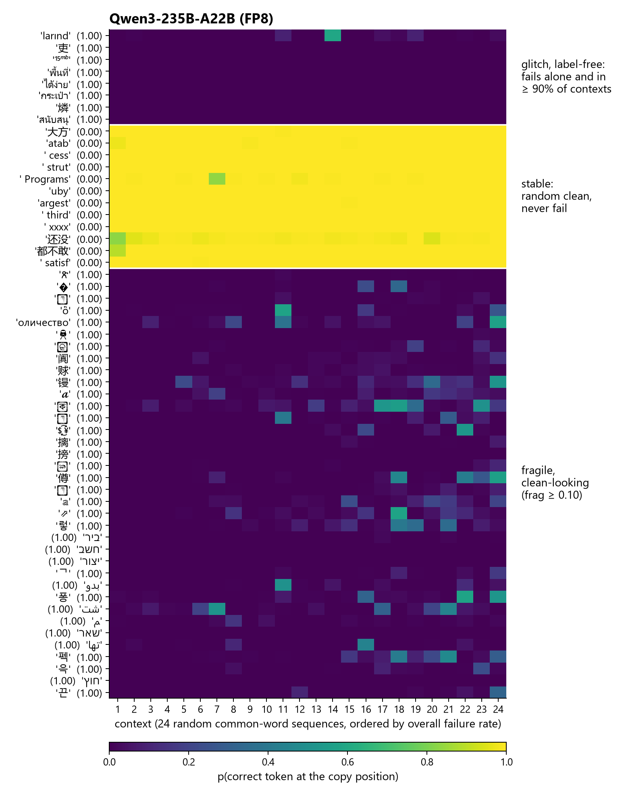
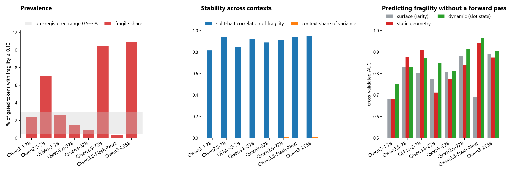
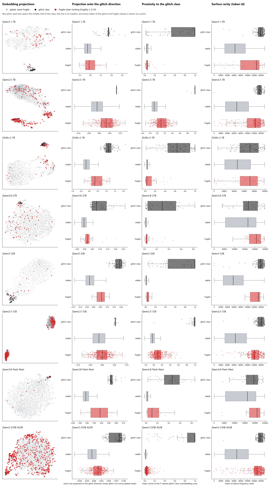

# Fragile Tokens

### Context-dependent copy failure on tokens that pass single-token glitch probes

Jeffrey R. Gordon · September 2026

## Abstract

Glitch-token detectors evaluate each vocabulary entry in isolation, usually by asking the model to repeat it. This paper measures what that evaluation misses. I placed tokens into banks of random ordinary contexts and scored the copy at each position. Under one gate applied to eight models, between 0.4% (Qwen3.8-Flash-Next) and 10.9% (Qwen3‑235B) of tokens that pass the single-token probe fail to copy in at least one of ten contexts. The property belongs to the token, not the context: the context explains at most 0.013 of the variance on any model, and a token’s fragility on half of the contexts predicts its fragility on the other half at 0.82 to 0.95. The fragile tokens are canonical and ordinary. The English word `according` copies alone at probability 0.999 and is deleted in 44 of 48 contexts, at probability 1.000 in the worst. Failures take four forms: deletion, neighbor substitution, truncation, and translation; on four of the seven models with a specimen store, most failing cells are confident, below 2 bits of entropy, and the modes recur across the ladder.

Given a fragile or glitch token as an entire prompt, no model asks about the token it was given. The smaller models ask for clarification about a token they have already replaced; OLMo-2‑7B explains a plausible neighbor; Qwen3‑32B and Qwen3.8‑27B write out the solution to a problem that was never posed. Seeded with its fragile tokens instead, each model reproduces the seed more often than a glitch seed and less often than a stable token, and often copies it back while misreading it: a Japanese token glossed as Korean, a Hebrew word answered as Chinese. On Pythia-1.4b, where labels of the same kind exist, a glitch token’s identity is recoverable from its final-layer state as reliably as a healthy token’s, so the failure is at the readout. Tokens do not combine to produce the behavior: a pre-registered factorial screen over ordered pairs at separations of 2 to 128 positions finds no more pairs that copy worse than their parts than a matched additive null yields, on OLMo-2‑7B, Qwen3‑32B or Qwen3‑235B, and a repeated token copies better, not worse.

Fragile tokens sit next to glitch tokens in embedding space on every model with untied embeddings. Their cosine proximity to the model’s glitch class separates them from stable tokens at 0.74 to 0.90 on seven of the eight models, where a random reference set gives 0.41 to 0.55; the projection onto a single glitch direction, used by earlier detectors, misses this relation on the models whose fragile tokens are rare characters. Inside assignments with tools, Qwen3‑32B and Qwen3.8‑27B, given a glitch token, search for the sentence with the token removed, retrieve nothing, and deliver a recommendation anyway; the 27B also loops, hitting the round cap in 86% of glitch episodes. Every failing case is released with model provenance.

## 1. Introduction

Glitch token detection has proceeded one token at a time since the first catalog of anomalous strings in GPT-2 (Rumbelow and Watkins). Magikarp ranks vocabulary entries by indicators computed from the unembedding matrix and verifies candidates with a repetition prompt (Land and Bartolo); GlitchHunter clusters (Li et al.); GlitchProber classifies intermediate activations (Zhang et al.); GlitchMiner optimizes next-token entropy (Wu et al.); GlitchQuiz applies a battery of templates (Tang et al.). Each answers the question, “Is this token defective?” with the token alone in the prompt, and each is accurate on its own terms.

Field reports describe behavior that this question does not address: tokens that a reasoning model “struggles to identify” or “conflates” with another script, or that behave correctly in isolation and incorrectly inside a longer input. Two accounts fit such reports. On the compositional account, particular combinations of tokens, possibly individually healthy and possibly widely separated, produce the behavior. On the contextual account, a token's surroundings determine whether it is exposed. The two accounts imply different detectors.

I first tested both on OLMo-2‑7B, the reference model, for which an independent group published behavioral labels (Land and Bartolo; 3,171 tokens tested by repetition probe, 442 verified as failing). I then tested the findings label-free on seven Qwen models across three generations, against quantities and ranges fixed before any of them ran. Table 1 lists the models in the order every table and figure of the paper uses: by parameter count, and by generation where sizes tie. The models are documented by their developers (OLMo Team; Qwen Team, “Qwen2.5”; Qwen Team, “Qwen3”; Qwen Team, “Qwen3.8-Max”).

**Table 1.** *Tokens* are the number of sampled token IDs scored in every context; OLMo-2‑7B has a first bank and an independent replication bank. *Framing* is how the copy prompt is presented (§8.1). All generation is greedy, and every prompt is assembled from token IDs.

| model | generation | parameters | vocabulary | embeddings | precision | contexts × tokens | framing |
|:---|:---|:---|---:|:---|:---|---:|:---|
| Qwen3-1.7B | Qwen3 | 1.7B | 151,936 | tied | bf16 | 24 × 4,200 | raw |
| Qwen2.5-7B-Instruct | Qwen2.5 | 7.6B | 152,064 | untied | bf16 | 24 × 8,400 | raw |
| OLMo-2-1124-7B-Instruct | OLMo 2 | 7.3B | 100,352 | untied | fp16 | 48 × 2,098; 24 × 6,273 | raw |
| Qwen3.8-27B | Qwen3.8 | 27B | 248,320 | untied | bf16 | 24 × 8,400 | chat |
| Qwen3-32B | Qwen3 | 32B | 151,936 | untied | bf16 | 24 × 4,200 | raw |
| Qwen2.5-72B-Instruct | Qwen2.5 | 72B | 152,064 | untied | bf16 | 24 × 8,400 | raw |
| Qwen3.8-Flash-Next-FP8 | Qwen3.8 | about 175B total, about 3B active, 512 experts | 248,320 | untied | FP8 | 24 × 8,400 | chat |
| Qwen3-235B-A22B-FP8 | Qwen3 | 235B total, 22B active, 128 experts | 151,936 | untied | FP8 | 24 × 8,400 | raw |

The findings, in the order the paper presents them:

1. **Fragility is a stable, measurable property of the token** (§3). Between 0.4% and 10.9% of tokens that pass the single-token probe fail in at least a tenth of ordinary contexts. The context contributes almost nothing; the same tokens fail on independent context banks; the same four failure modes recur across models.

2. **The failure is confident substitution, and larger models substitute more consequentially** (§4). A model given a glitch token answers about a different token, at low entropy, and completes its task on the substituted content; given a fragile token, it reproduces it more often and still misreads it. The token's identity reaches the final layer intact, as measured on Pythia-1.4b.

3. **Fragile tokens sit next to glitch tokens in the embedding** (§5). On every untied model, proximity to the model's glitch class in embedding space predicts fragility; on models whose fragile tokens are rare characters, rarity predicts it as well or better, and a single glitch direction misses the relation. The token's representation in context predicts fragility beyond rarity on five models with the interval clear of zero.

4. **Tokens combine additively** (§6). The compositional account is not supported at any separation on any of the three models tested; a repeated token copies better.

5. In-task, the token is dropped from the plan, and the task finishes anyway (§7). Given a glitch token in an assignment with tools, Qwen3‑32B and Qwen3.8‑27B search for the sentence with the token removed, retrieve nothing, and write a recommendation from generic material; the 27B loops. Stable tokens are looked up by name and written up correctly.

Section 8 collects the method decisions a reader needs to interpret the numbers, and §9 states the scope.

## 2. A token that passes alone and fails in context

The English word `according` is token 4184 in the OLMo-2 vocabulary, among the most frequent pieces, and it is canonical: decoding the ID and re-encoding the string returns the same ID. Under the single-token probe used by every detector, the log-probability of the correct continuation is −0.001. The probe is the copy prompt of §3.1 with the token alone as the text:

```
Repeat the text exactly.
Text: apple pie is good
Copy: apple pie is good
Text: the quick brown fox
Copy: the quick brown fox
Text: according
Copy:
```

 By the standard in use since 2023, the token is healthy.

The same token was placed in sequences of ordinary common words drawn at random, so that the surroundings were not chosen, and the model was asked to repeat the sequence. In the context *deliver rel behind according sent floor wrong*, at the position where the copy should produce `according`, the model produced `sent` with probability 1.000 and entropy 0.00 bits, then continued the copy correctly from that word. Across 48 such contexts, the token was deleted in 44. In the remaining four, it was copied at 0.999.

The token did not change between the two measurements. The first was made in a context where the copying mechanism has one candidate; the second in the contexts a token ordinarily occupies. A score on a token in isolation measures whether the model can reproduce it when nothing competes. Whether that reproduction survives surrounding text is a distinct question, and it is the question a system that assembles prompts programmatically poses on every call. Section 3 measures how common the pattern is.

## 3. Fragility is a property of the token

### 3.1 Definitions

Contexts are sequences of common, individually clean words drawn at random, of lengths 8, 16, 32 and 64, with an interior slot at a random position. I place every token from a sample into every context, stratified by ID range. A **cell** is the copy log-probability of the token at its slot under the repetition prompt; a cell **fails** below −0.5 (probability 0.61); a token’s **fragility** is the fraction of contexts in which it fails. Because every token meets the same contexts, differences in fragility are differences between tokens. The copy prompt, with the two demonstrations every model saw, is:

```
Repeat the text exactly.
Text: apple pie is good
Copy: apple pie is good
Text: the quick brown fox
Copy: the quick brown fox
Text: <the context words, with the token in its slot>
Copy: <scored here, token by token>
```

Under the chat framing of the Qwen3.8 models (§8.1), the same text is the user turn and `Copy:` opens the assistant turn.

A token is **clean-looking** if it passes a gate on its single-token probe score. Two gates are used. The **absolute gate**, lp_alone > −0.1, admits a token that copies alone at probability 0.9 or better. It depends on how well a model answers the bare few-shot probe, which varies by model: Qwen3-32B copies ordinary tokens in context at 0.997 but under the probe at 0.72 to 0.89, so the absolute gate admitted 353 of its 4,200 tokens and called none fragile. The **greedy gate**, p_alone > 0.5, admits a token that is the greedy output of its own probe, which means the same thing on every model. Cross-model statements use the greedy gate; OLMo-2-7B is reported under both.

Among clean-looking tokens, a token is **fragile** if its fragility is at least 0.10, and **stable** if it never fails. The **glitch class** is the 442 verified glitch tokens on OLMo-2‑7B and, on the label-free models, the 100 worst tokens by the single-token probe among those that fail in at least 90% of contexts; §8.3 shows why the in-context condition is needed. Four **failure modes** are distinguished at a failing cell: **deletion**, the following context word is emitted, and the copy continues from it; **substitution**, a neighbor is emitted; **truncation**, a prefix of the token; **translation**, the same word in another language. A failing cell is **confident** when the entropy of the distribution at the slot is below 2 bits.

### 3.2 The dependence is on the token

















**Figure 1.** Fragility matrices under the greedy gate, one per model in order of size: Qwen3‑1.7B, Qwen2.5‑7B, OLMo-2‑7B (replication bank), Qwen3.8‑27B, Qwen3‑32B, Qwen2.5‑72B, Qwen3.8-Flash-Next, Qwen3‑235B-A22B; each panel is titled with its model. Each row is a token, each column one of the model’s 24 contexts ordered by overall failure rate, and each cell is the probability of the correct token at the copy position. Three blocks in the same order on every panel: eight glitch-class tokens, which fail everywhere; twelve stable tokens, which fail nowhere; the most fragile clean-looking tokens, up to 36, with their fragility in parentheses (Qwen3‑32B and Flash-Next have 15 each). The structure is horizontal on every panel: rows are dark or bright, columns are not

Table 2: Decomposes the cells of the OLMo-2‑7B first bank into a grand mean, a token effect, a context effect, and a residual. The token carries the variance; the context carries none.

**Table 2.** Variance decomposition of the OLMo-2-7B first bank, log-probability scale, and the failure rate of clean-looking tokens by context length.

| tokens | token share | context share | residual share | fail rate at K = 8 | K = 16 | K = 32 | K = 64 |
|:---|---:|---:|---:|---:|---:|---:|---:|
| all 2,098 | 0.952 | 0.001 | 0.047 | | | | |
| clean-looking | 0.717 | 0.000 | 0.282 | 0.005 | 0.008 | 0.008 | 0.008 |

No context is generally hostile: the most severe of the 48 fails 19% of tokens and the least severe 11%. A held-out check confirms the asymmetry. Predicting whether a token fails in a context it was not scored in, the token’s fragility in other contexts gives AUC 0.94, the context’s hostility on other tokens gives 0.56, and a measure of similarity between the token and its surrounding words adds nothing to either. The features examined do not predict which context elicits a given token’s failure; they do predict that the token will fail somewhere. The exception to the flat length profile is Qwen2.5‑72B, whose fragile tokens fail more in longer contexts: 33% of 8-token contexts and 52% of 64-token contexts under the greedy gate.

### 3.3 Prevalence and stability across eight models

**Table 3.** Fragility among clean-looking tokens under the greedy gate, with OLMo-2‑7B also under the absolute gate. *Never fail* is the share of clean-looking tokens with fragility zero. *Split-half* is the correlation of fragility between even- and odd-numbered contexts (first bank: AUC). *Context share* is the context’s share of variance on the clean-looking matrix. *Confident* is the share of failing cells of fragile tokens with entropy below 2 bits, and the median entropy of those cells, read from the greedy-gate specimen store (§3.5); OLMo-2‑7B has no greedy-gate store.

| model | gate | clean-looking | fragile | never fail | split-half | context share | confident | median entropy |
|:---|:---|---:|---:|---:|---:|---:|---:|---:|
| Qwen3-1.7B | greedy | 1,666 | **2.4%** (40) | 93.0% | 0.82 | 0.004 | 74% | 1.14 bits |
| Qwen2.5-7B | greedy | 4,217 | **7.0%** (296) | 85.5% | 0.94 | 0.001 | 14% | 7.16 bits |
| OLMo-2-7B, first bank | absolute | 873 | **1.6%** (14) | 92.1% | AUC 0.996 | 0.000 | | |
| OLMo-2-7B, replication bank | absolute | 1,888 | **1.5%** (29) | 95.0% | | | | |
| OLMo-2-7B, replication bank | greedy | 2,183 | **2.7%** (58) | 92.9% | 0.85 | 0.001 | | |
| Qwen3.8-27B | greedy | 3,766 | **1.5%** (57) | 96.1% | 0.92 | 0.001 | 57% | 1.79 bits |
| Qwen3-32B | greedy | 1,597 | **0.9%** (15) | 95.7% | 0.89 | 0.002 | 39% | 2.95 bits |
| Qwen2.5-72B | greedy | 3,998 | **10.5%** (418) | 82.6% | 0.91 | 0.013 | 59% | 1.02 bits |
| Qwen3.8-Flash-Next | greedy | 4,047 | **0.4%** (15) | 99.2% | 0.94 | 0.000 | 16% | 5.31 bits |
| Qwen3-235B-A22B | greedy | 6,277 | **10.9%** (684) | 79.9% | 0.95 | 0.010 | 62% | 1.43 bits |



**Figure 2.** The ladder under the greedy gate, ordered by model size. Left: the share of clean-looking tokens that are fragile, with the pre-registered replication range of 0.5 to 3% shaded; the shares and counts are in Table 3. Middle: the split-half correlation of fragility and the context’s share of variance, both from Table 3. Right: cross-validated AUC of the surface, static-geometry, and dynamic tiers of §5 for predicting fragility; the values and the number of positives are in Table 10b.

The glitch class validates the measure: verified glitch tokens fail in nearly every context (mean fragility 0.993 in the first bank), and none passes either gate. Among tokens that pass, the property is stable on every model: fragility on even contexts predicts fragility on odd contexts at 0.82 to 0.95, `according` scored 0.92 on both OLMo-2‑7B banks, and the context’s share of variance never exceeds 0.013.

The pre-registered expectation that prevalence would fall with model size held within Qwen3 from 1.7B to 32B and failed for both models above 70B total parameters. Because the 235B passes three-quarters of its sample through the probe, I checked its prevalence on the token IDs it shares with smaller models (Table 4): it remains three to five times as fragile on identical IDs. Family sets a level and size moves it: within Qwen2.5, 7.0% at 7B and 10.5% at 72B; within Qwen3, 2.4% at 1.7B, 0.9% at 32B and 10.9% at 235B; the Qwen3.8 generation’s 27B, at 1.5%, sits between the two smaller Qwen3 models. Flash-Next, a 512-expert mixture with about 3B parameters active per token, is the least fragile model in the ladder at 0.4%, and it admits the same share of its sample as the 72B, so the size of the gate does not set the level. Ordered by total parameters, the two largest models are the most fragile, and Flash-Next breaks the trend; ordered by active parameters, Flash-Next sits below the 7B models, and the trend survives. The ladder cannot separate the two readings.

**Table 4a.** Fragility on shared token IDs, greedy gate: for each pair, the IDs look clean on both models and are fragile on each.

| pair | shared clean-looking ids | fragile, smaller model | fragile, Qwen3-235B |
|:---|---:|---:|---:|
| Qwen3-1.7B and Qwen3-235B | 1,592 | 2.0% | 6.2% |
| Qwen3-32B and Qwen3-235B | 1,569 | 0.8% | 4.3% |

**Table 4b.** The detectors’ view of the fragile tokens. Magikarp (Land and Bartolo) publishes, for each model it examined, a category for every vocabulary entry, an indicator score computed from the embedding matrices, and the outcome of its repetition prompts on the tokens the indicators put forward as candidates. For the three models of this ladder it covers, the table gives what it says about the tokens this paper calls fragile under the greedy gate, and the reverse check: how the glitch tokens it verified fare on this paper’s gate and matrix. *Candidate* means the indicators flagged the token and the prompts were run; *rejected* is Magikarp’s own verdict that the token is not a glitch token.

| model | fragile tokens | in Magikarp's OK category | undecodable byte pieces | candidates by its indicators | verdict on the candidates | Magikarp-verified glitch tokens in this paper's sample | of those, pass the greedy gate | their mean fragility |
|:---|---:|---:|---:|---:|:---|---:|---:|---:|
| Qwen2.5-7B-Instruct | 294 | 280 | 14 | 1 | rejected (1 of 1) | 122 | 0 | 1.00 |
| OLMo-2-7B (replication bank) | 58 | 58 | 0 | 8 | rejected (8 of 8) | 442 in the vocabulary | 0 | 0.99 |
| Qwen3-32B | 15 | 14 | 1 | 0 | no candidate | 30 | 0 | 0.99 |

By Magikarp's account, no fragile token on any of the three models is a glitch token. Its indicators do not single them out: the 58 OLMo-2‑7B fragile tokens sit between the 0th and the 97th percentile of its main indicator, and on Qwen3‑32B none of the 15 were candidates at all. When its prompts ran on a fragile token, they passed at repetition probabilities of 0.75 to 0.999. The disagreement runs one way only: every glitch token Magikarp verified fails this paper’s gate and its contexts. The fifteen undecodable entries are byte fragments that Magikarp excludes from testing; every other fragile token is a decodable, canonical string in its OK class. The five models without published labels are held to the detectors’ own criterion: the repetition prompt, to which the gate in §3.1 applies.

### 3.4 The fragile tokens, and what the model emits instead

**Table 5.** The three classes on every model, in the order of Figure 1: one glitch-class token, one stable token, and the fragile clean-looking tokens, with the emission at the token’s worst context read from the specimen stores (§3.5). *Alone* is the single-token-*p*robe copy probability; p is the probability of the emitted token at the worst context. Ranges cover a class of tokens.

| model | class | token | alone | fragility | emitted | p | mode |
|:---|:---|:---|---:|---:|:---|---:|:---|
| Qwen3-1.7B | glitch | `格會員` | 0.000 | 1.00 | a newline | 0.58 | substitution |
| Qwen3-1.7B | stable | ` spaced` | 1.000 | 0.00 | ` spaced`, copied in every context | 1.000 | copied |
| Qwen3-1.7B | fragile | ` 방법` (Korean, "method") | 0.96 | 0.75 | ` 方法` (Chinese, "method") in three contexts of four | 0.93 to 0.97 | translation |
| Qwen3-1.7B | fragile | ` Marshal` | 0.93 | 0.46 | `Marshal` | 0.998 | truncation |
| Qwen3-1.7B | fragile | ` widać` (Polish, "visibly") | 0.80 | 0.83 | a neighbor | | substitution |
| Qwen2.5-7B | glitch | `䨰` | 0.000 | 1.00 | ` cap`, the following word | 1.000 | deletion |
| Qwen2.5-7B | stable | ` on` | 1.000 | 0.00 | ` on`, copied in every context | 1.000 | copied |
| Qwen2.5-7B | fragile | `⌕`, `圊`, `冔`, `柷` and other single rare characters | 0.63 to 0.91 | 1.00 | the chat template's own `<\|im_start\|>` | 0.39 to 0.83 | substitution |
| Qwen2.5-7B | fragile | `ঈ` (Bengali letter) | 0.83 | 1.00 | ` staat`, at 9.3 bits | 0.07 | substitution |
| OLMo-2-7B | glitch | `.DataGridViewColumnHeadersHeightSizeMode` (verified glitch token) | 0.000 | 1.00 | fails in every context | at most 0.000 for the token | deletion |
| OLMo-2-7B | stable | ` pockets` | 0.999 | 0.00 | ` pockets`, copied in every context | 1.000 | copied |
| OLMo-2-7B | fragile | ` according` | 0.999 | 0.92 | ` sent`, the following word; the copy continues from it | 1.000 | deletion |
| OLMo-2-7B | fragile | ` due` | 1.000 | 0.42 | the following word | 1.000 | deletion |
| OLMo-2-7B | fragile | ` который` (Russian, "which") | 0.983 | 0.71 | ` что` ("what") | | substitution |
| OLMo-2-7B | fragile | ` pueden` (Spanish, "they can") | 0.970 | 0.62 | ` pena` | 0.78 | substitution |
| OLMo-2-7B | fragile | ` abbiamo` (Italian, "we have") | 0.980 | 0.60 | ` abdom`, continued to "abdominoplasty" | | substitution |
| OLMo-2-7B | fragile | ` sólo` (Spanish, "only") | 0.968 | 0.48 | ` só` | 0.89 | truncation |
| OLMo-2-7B | fragile | ` 查询` (Chinese, "query") | 0.985 | 0.46 | ` QUERY` | 0.97 | translation |
| OLMo-2-7B | fragile | ` getSystemService` | 0.948 | 0.38 | `SystemService` | 0.30 | truncation |
| Qwen3.8-27B | glitch | ` ForCanBeConverted` | 0.000 | 1.00 | ` activity`, the following word | 1.000 | deletion |
| Qwen3.8-27B | stable | ` Gip` | 0.997 | 0.00 | ` Gip`, copied in every context | 1.000 | copied |
| Qwen3.8-27B | fragile | ` оказаться` (Russian, "to turn out") | 0.89 | 0.96 | ` occur` | 0.48 | translation |
| Qwen3.8-27B | fragile | ` грунт` (Russian, "soil") | 0.84 | 0.79 | ` grunt` | 0.995 | substitution |
| Qwen3.8-27B | fragile | ` 아버지` (Korean, "father") | 0.99 | 0.92 | `아버` | 0.99 | truncation |
| Qwen3.8-27B | fragile | ` espectacular` (Spanish) | 0.83 | 0.62 | ` spectacular` | 0.65 | translation |
| Qwen3-32B | glitch | `ớ` | 0.000 | 1.00 | ` professional`, the following word | 0.53 | deletion |
| Qwen3-32B | stable | ` Fiesta` | 0.873 | 0.00 | ` Fiesta`, copied in every context | 1.000 | copied |
| Qwen3-32B | fragile | ` след` (Russian, "trace") | 0.61 | 0.83 | ` follow` | 0.995 | translation |
| Qwen3-32B | fragile | ` realtà` (Italian, "reality") | 0.76 | 0.38 | ` réalité` (French) | 0.90 | translation |
| Qwen3-32B | fragile | ` اليمن` (Arabic, "Yemen") | 0.77 | 0.12 | ` Yemen` | 0.72 | translation |
| Qwen3-32B | fragile | `ཀ` (Tibetan letter) | 0.52 | 0.42 | ` greater`, the following word | 0.93 | deletion |
| Qwen2.5-72B | glitch | `눠` | 0.000 | 1.00 | the chat template's own `<\|im_end\|>`, at 7.6 bits | 0.28 | substitution |
| Qwen2.5-72B | stable | ` measuring` | 1.000 | 0.00 | ` measuring`, copied in every context | 1.000 | copied |
| Qwen2.5-72B | fragile | `跸` and 42 other single rare CJK characters | 0.92 to 1.00 | 0.4 to 1.0 | the following word | 0.50 to 1.00, median 0.98 | deletion |
| Qwen2.5-72B | fragile | `увеличен` (Russian, "increased") | 0.97 | 0.46 | ` exaggerated` | 0.998 | substitution |
| Qwen2.5-72B | fragile | ` الاسلام` (Arabic, "Islam") | 0.92 | 1.00 | a neighbor | | substitution |
| Qwen3.8-Flash-Next | glitch | ` szexf` | 0.000 | 1.00 | ` size`, the following word | 0.58 | deletion |
| Qwen3.8-Flash-Next | stable | ` quas` | 0.996 | 0.00 | ` quas`, copied in every context | 1.000 | copied |
| Qwen3.8-Flash-Next | fragile | ` ilmaisia` (Finnish, "free") | 0.92 | 0.96 | ` gratuita`, at 12.0 bits | 0.03 | substitution |
| Qwen3.8-Flash-Next | fragile | ` επίσης` (Greek, "also") | 0.93 | 0.38 | ` также` (Russian, "also") | 0.74 | translation |
| Qwen3.8-Flash-Next | fragile | ` 웹사이트가` (Korean, "the website") | 0.89 | 0.46 | ` websites` | 0.43 | translation |
| Qwen3-235B-A22B | glitch | `larınd` (Turkish suffix) | 0.000 | 1.00 | a newline | 0.55 | substitution |
| Qwen3-235B-A22B | stable | ` brink` | 1.000 | 0.00 | ` brink`, copied in every context | 1.000 | copied |
| Qwen3-235B-A22B | fragile | `僔`, `ഏ`, `𝕒`, `𝙰`, `狴`, `🤜` and other single rare-script characters | 0.94 to 1.00 | 0.83 to 1.00 | the following word | 0.999 to 1.000 | deletion |
| Qwen3-235B-A22B | fragile | `интер` (Cyrillic stem) | 0.98 | 0.92 | `inter` | 1.000 | translation |

The four modes of §3.1 account for every row, and each reverses when the filler words change: `according` is deleted at 1.000 in three stored contexts and copied at 1.000 in a fourth. Translation, a single case on OLMo-2-7B, recurs on every Qwen3 and Qwen3.8 model.

The fragile tokens are canonical. Every fragile clean-looking token in the OLMo-2‑7B first bank round-trips from id to string to the same id, is in Unicode composed form, and is classed `OK` in the labeling group’s taxonomy; Table 4b extends the check to the detector’s own verdicts on three models. The population differs by model. On OLMo-2‑7B, Qwen3‑1.7B, Qwen3.8‑27B, Qwen3‑32B and Flash-Next it is word pieces from languages thin in the training mix (Spanish, Italian, Portuguese, German, Polish, Finnish, Hungarian, Russian, Chinese, Korean, Arabic, Hebrew, Tibetan), code identifiers, and a few high-frequency English connectives. On Qwen2.5‑7B, Qwen2.5‑72B, and Qwen3‑235B it is the rare-character tail of the vocabulary: single CJK characters on the two Qwen2.5 models (43 of the 72B’s 80 most fragile tokens) and every rare script at the 235B, Tibetan, Bengali, Sinhala and Malayalam letters, Hebrew and Arabic pieces, Hangul syllables, mathematical-alphabet letters and emoji. The confidence of the failures follows the population (Table 3): the rare-character deletions of the 72B and the 235B and the word-piece substitutions of the 27B are confident in most cells, while Qwen2.5‑7B, which replaces its rare characters with its chat template’s own marker, and Flash-Next, which replaces Finnish and Hungarian stems with guesses spread over many scripts, fail uncertainly.

Two mechanisms could produce the pattern. The two English cases with catastrophic scores, `according` and `due`, are words whose following `to`ken is almost invariably to, and several fragile connectives in other languages (`mentre`, `allerdings`, `może`, `который`) likewise constrain their successor strongly, so fragility may track the concentration of a token’s continuation distribution. A deletion at probability 1.000 and entropy zero is also the signature of a copy-suppression head (McDougall et al.). We do not test either here (§9).

### 3.5 The specimen store

For each fragile token and for the glitch class, the three worst cells and one control cell are stored with the exact context and slot, the five most probable emissions and their probabilities, the entropy at the position, the probability of the correct token, the greedy continuation where generation was run, and a failure-mode label. Each store carries the model, commit, precision, depth, width, vocabulary size, tying, and library versions, and is released with the paper. The claim that the failures are confident is directly verifiable from them.

## 4. The failure is a confident substitution

### 4.1 On the reference model

32 verified glitch tokens and 32 healthy controls were each spliced by ID into the OLMo-2‑7B chat template as the last item of the user turn: *What is this token? Identify it exactly, then explain step by step what it means:* the assistant turn was pre-filled with *Let me think about this carefully.*, and 256 tokens were generated for each. I first tested two predictions drawn from the field reports, and neither held. The difference in next-token entropy between glitch-seeded and control-seeded responses is +0.27 bits at step 8 and −0.29 bits at step 255; it does not grow with length. Responses seeded by different glitch tokens do not converge on a common state: the mean pairwise cosine of their centered final-layer states decays from 0.016 to 0.0001 for glitch seeds and from 0.017 to 0.0002 for controls.

The model instead answers about a different token. Table 6 shows the supplied token, whether the model reproduced it, the token the model said it had been given, and the opening of the explanation that followed.

The input for every row of Table 6, with the token spliced by ID at the end of the user turn and 256 tokens generated after the assistant prefix:

```
user:      What is this token? Identify it exactly, then explain step by step what it means: <token>
assistant: Let me think about this carefully.
```

**Table 6.** OLMo-2‑7B: the token supplied and the model’s account of it. *Reproduced* is by exact token id within the response. The same model seeded with its fragile tokens, under the token-alone prompt of §4.2, is in Tables 7b and 9.

| token supplied | class | reproduced | model said it was given | opening of the explanation |
|:---|:---|:---|:---|:---|
| `.XtraLayout` | glitch | no | `"layui"` | a lightweight, modular, and flexible JavaScript framework primarily used for building web interfaces |
| ` Hexatrigesimal` | glitch | no | `"Calculus"` | a branch of mathematics that deals with the study of change, motion, and accumulation |
| `雅黑` | glitch | no | `"턱"` (Korean Hangul) | represents the consonant sound "t" or "d" … combined with the vowel "u" to form the syllable "ttuk" |
| ` didn` | glitch | no | `"don"` | a short form or abbreviation of "do not" |
| `.AddModelError` | glitch | no | `ErrorDictionary` | is not a standard token in programming languages … it might be a misunderstanding or a typo |
| `.JpaRepository` | glitch | no | `"IpaRepository"` | does not directly correspond to a widely recognized term or acronym |
| `")){\r\n` | glitch | no | `){` | a closing curly brace (`}`) in programming syntax |
| `.ContextCompat` | glitch | no (leading `.` dropped) | `ContextCompat` | a static utility class in the Android SDK, correct apart from the punctuation |
| ` woman` | control | yes | `"woman"` | a noun in the English language |
| ` actually` | control | yes | `"actually"` | an adverb in the English language |
| ` life` | control | yes | `"life"` | a concept that has been extensively explored across various disciplines |
| `,\r\n` | control | no | `",` | a quotation mark or double quote character in ASCII |
| `.onOptionsItemSelected` | control | no (leading `.` dropped) | `"OptionsItemSelected"` | not a standalone token with a universally recognized meaning |
| ` according` | fragile | no | the "integral sign" | a mathematical symbol used to represent a specific concept … the "integral sign", which looks |
| ` который` | fragile | no (truncated) | "котор." | Step-by-step Explanation: 1. Language Identification: "Котор" is a word in the Russian language |
| ` MaterialPageRoute` | fragile | no | "PageRoute", then corrected to `PageRouteBuilder` | is not exactly correct; the correct token you're referring to is `PageRouteBuilder` or `Route`, which are part of Flutter's navigation |
| ` allerdings` | fragile | no | "actually" | in German translates to "however" in English. It is used to introduce a statement that contrasts with what has already been mentioned |
| ` erklä` | fragile | no | "ehlær" | appears to be a misspelling or a typo. If we correct it to "ehlær" (which seems to be a Scandinavian language word), it could be |

Across the 32 glitch seeds, the model reproduced the token it was shown 0 times by exact ID; across the 32 controls, 17 times; across 32 fragile seeds under the same prompt, 11 times, with the misreadings of Table 6 where it did not. The characteristic glitch response is a fluent account of a plausible neighbor, delivered at 0.85 to 1.3 bits of entropy and, in every case, followed by a step-by-step explanation of the substituted token. In the short-completion regime, the same seeds were simply continued as though a definition were being written, and no seed in either group was reproduced. That regime masks a single-token failure; the reasoning-style prompt exposes it because the task requires the model to refer to the token rather than continue past it. In the tasks of §7.1 the model completed the task in 0.96 to 1.00 of episodes in every class. The model neither halts nor signals uncertainty; it completes the task on substituted content. This is the appropriate statement of the hazard, and it accounts for why detectors built on entropy do not observe it.

### 4.2 Across the ladder

I ran the same label-free measurement on every model that generates at practical speed, with the token as the whole user turn of the model’s own chat template and the assistant turn pre-filled with *Let me think about this carefully.* The seed set is the 32 tokens each model copies worst under the single-token probe, restricted to printable strings, and the controls 32 tokens it copies exactly. The two FP8 mixtures cannot generate at practical speed (§8.4); Table 7a lists them, and Table 8 gives the teacher-forced counterpart for the same measurement. Tables 7a and 7b give the counts (§8.3 explains why two ways of counting are needed), and Table 9 gives the responses.

Each model was handed 32 tokens one at a time as the entire prompt, and the answer was searched for the token it had been given. The input for every row of Tables 7a and 7b, the token as the whole user turn under the model's own chat template, with 256 tokens generated after the assistant prefix:

```
user:      <token>
assistant: Let me think about this carefully.
```

Two ways of finding it are counted: the identical token ID among the generated IDs, and the token’s text spelled by any tokens. Table 7a presents the model’s 32 worst tokens by the single-token probe, their glitch class, alongside 32 ordinary tokens the model copies exactly. Table 7b presents the model’s most fragile clean-looking tokens alongside the same number of stable tokens.

**Table 7a.** Glitch seeds of 32 glitch-class tokens handed over one at a time, how many the model wrote back, beside 32 ordinary tokens. On Qwen3‑1.7B and OLMo-2‑7B the text check was made on the eight logged answers per group.

| model | prompt mode | glitch tokens written back, identical id | glitch tokens written back, same text | ordinary tokens written back, identical id | ordinary tokens written back, same text |
|:---|:---|---:|---:|---:|---:|
| Qwen3-1.7B | plain | 0 of 32 | 1 of 8 | 14 of 32 | 8 of 8 |
| Qwen3-1.7B | thinking | 0 of 32 | 1 of 8 | 16 of 32 | 8 of 8 |
| Qwen2.5-7B | plain | 0 of 32 | 1 of 32 | 17 of 32 | 32 of 32 |
| OLMo-2-7B | plain | 0 of 32 | 0 of 8 | 17 of 32 | 7 of 8 |
| Qwen3.8-27B | plain | 5 of 32 | 19 of 32 | 11 of 32 | 32 of 32 |
| Qwen3.8-27B | thinking | 6 of 32 | 22 of 32 | 17 of 32 | 32 of 32 |
| Qwen3-32B | plain | 0 of 32 | 0 of 32 | 17 of 32 | 29 of 32 |
| Qwen3-32B | thinking | 0 of 32 | 0 of 32 | 23 of 32 | 32 of 32 |
| Qwen2.5-72B | plain | 0 of 32 | 12 of 32 | 14 of 32 | 27 of 32 |
| Qwen3.8-Flash-Next | plain | not run: no generation at practical speed (§8.4); teacher-forced counterpart in Table 8 | | | |
| Qwen3-235B-A22B | plain | not run: no generation at practical speed (§8.4); teacher-forced counterpart in Table 8 | | | |

**Table 7b.** Fragile seeds of the model’s most fragile clean-looking tokens handed over one at a time, how many it wrote back, beside the same number of stable tokens. Qwen3‑32B has 14 fragile tokens in its sample; the others have at least 32.

| model | prompt mode | fragile tokens written back, identical id | fragile tokens written back, same text | stable tokens written back, identical id | stable tokens written back, same text |
|:---|:---|---:|---:|---:|---:|
| Qwen3-1.7B | plain | 12 of 31 | 26 of 31 | 16 of 31 | 30 of 31 |
| Qwen2.5-7B | plain | 21 of 32 | 26 of 32 | 21 of 32 | 30 of 32 |
| OLMo-2-7B | plain | 6 of 32 | 19 of 32 | 20 of 32 | 29 of 32 |
| Qwen3.8-27B | plain | 7 of 32 | 27 of 32 | 10 of 32 | 32 of 32 |
| Qwen3-32B | plain | 8 of 14 | 13 of 14 | 7 of 14 | 13 of 14 |
| Qwen2.5-72B | plain | not run | | | |
| Qwen3.8-Flash-Next | plain | not run (§8.4) | | | |
| Qwen3-235B-A22B | plain | not run (§8.4) | | | |

**Table 8.** Teacher-forced counterpart of Table 7a for the two FP8 mixtures. *Copied in context* is the share of the 768 cells (the 32 worst printable tokens by the single-token probe × 24 contexts) at which the token’s own id is emitted with probability at least 0.5, and the same for 32 controls drawn as in Table 7a. The glitch class is the number of stored worst tokens that fail in at least 90% of contexts; the emission columns describe those tokens’ worst cells.

| model | worst tokens copied in context | median p | controls copied in context | glitch class | deletion | substitution | median top-1 p | median entropy |
|:---|---:|---:|---:|---:|---:|---:|---:|---:|
| Qwen3.8-Flash-Next | 71% | 0.999 | 100% | 9 of 20 | 9 of 27 cells | 18 of 27 | 0.11 | 8.5 bits |
| Qwen3-235B-A22B | 0.1% | 0.000 | 96% | 20 of 20 | 49 of 60 cells | 11 of 60 | 0.94 | 0.47 bits |

The input for the bare-prompt rows of Table 9 is the one shown above Table 7a; for the copy-prompt and teacher-forced rows it is the copy prompt of §3.1 with the context given in the row.

**Table 9a.** What the model answered when the token was the whole user turn: the verbatim opening of what it generated after the assistant prefix, and what happened. *Class* is glitch (one of the model’s 32 worst seeds, the glitch class of §3.1), control (a token the model copies exactly), or fragile (one of the model’s most fragile clean-looking tokens, seeded the same way; Table 7b gives the counts). OLMo-2‑7B’s glitch and control rows are from the run of §4.1, whose user turn carries the instruction; every other row has the token alone. I selected rows to show the range of behavior, with one control per model; we release the complete generations with the paper. Qwen2.5‑72B’s fragile tokens and the two FP8 mixtures were not run under the bare prompt; their fragile rows give, at the token’s worst context under the copy prompt of §3.1, what the model emitted in the token’s place, with the greedy continuation for the 72B and the emission alone for the mixtures, which cannot generate at practical speed (§8.4). The mixtures’ glitch and control rows are read the same way.

| model | prompt mode | class | token given | opening of the response | what happened |
|:---|:---|:---|:---|:---|:---|
| Qwen3-1.7B | plain | glitch | `格會員` | *The user wrote "</think>  The phrase "</think>  The phrase " is incomplete or contains an error. It appears to be a fragment or a typo.* | read its own template marker as the user's text, then hedged |
| Qwen3-1.7B | plain | glitch | `.currentTarget` | *You mentioned `@this` in the context of JavaScript, but it's not a standard syntax in JavaScript. Let me clarify: In JavaScript, `this` refers to the object instance …* | neighbor substitution, then a lesson about the neighbor |
| Qwen3-1.7B | plain | fragile | `続きを読` (Japanese, "read more", fragility 1.00) | *The user mentioned "続きを読" which is a Korean term meaning "continue reading" or "read further." They might be referring to a book, article, or content …* | reproduced the token, called Japanese Korean |
| Qwen3-1.7B | plain | fragile | `뿍` (Korean syllable, fragility 1.00) | *You wrote "뿍" which is a Chinese character meaning "full" or "abundant." It's often used in contexts like "full of" or "abundant in."* | reproduced the token, called Korean Chinese and glossed the invented meaning |
| Qwen3-1.7B | plain | fragile | ` naprawdę` (Polish, "really", fragility 1.00) | *You said "przecież" which is a Polish word meaning "after all" or "after all that". But you also wrote "przecież" in the beginning, which is a bit con …* | replaced by a different Polish word, then explained |
| Qwen3-1.7B | plain | fragile | ` رائع` (Arabic, "wonderful", fragility 1.00) | *You said "réaliste" (realistic) and "réfléchi" (thoughtful). I want to create a story that is both realistic and thoughtful, with a touch of magic.* | replaced by two French words and a story request nobody made |
| Qwen2.5-7B | plain | glitch | `䨰` | *"You are Qwen, created by Alibaba Cloud. You are a helpful assistant." This is my starting point as provided by Alibaba Cloud. Could you please provide more context or specify what you would like to know or discuss about "you are Qwen"?* | recited its own system prompt and asked the user about it |
| Qwen2.5-7B | plain | glitch | `$insert` | *The command `\\insert` is not a standard LaTeX command, but it sounds like you might be referring to something specific in a document …* | sigil changed, answered about the result |
| Qwen2.5-7B | plain | control | ` khoản` (Vietnamese, "clause") | *"khoản" is a word that can have different meanings depending on the context. In Vietnamese, it can mean: 1. A section or paragraph in a document. 2. An amount of money.* | named and glossed |
| Qwen2.5-7B | plain | fragile | ` לציין` (Hebrew, "to note", fragility 1.00) | *"ⁿ"+"指" can form the word "指针", which means "pointer" in English. If you meant to write something else or have a specific context in mind, please provide more details …* | a Hebrew word became a Chinese one, then was explained |
| Qwen2.5-7B | plain | fragile | ` RTAL` (fragility 1.00) | *The text "<\|im_start\|>" seems to be incomplete or might be a typo. Could you please provide more context or clarify what you're trying to ask or say?* | read its own template marker as the user's text |
| Qwen2.5-7B | plain | fragile | `larında` (Turkish suffix, fragility 1.00) | *The phrase "ında" you've provided is a bit incomplete or unclear on its own. It looks like it might be part of a Turkish word or phrase …* | truncated, then the fragment was analysed |
| Qwen2.5-7B | plain | fragile | ` الاسلام` (Arabic, "Islam", fragility 1.00) | *"إسلام" (Islam) is the Arabic word for Islam, the religion founded by the Prophet Muhammad. It's one of the major world religions …* | respelled without its article, then glossed correctly |
| OLMo-2-7B | plain | glitch | `.XtraLayout` | *The token "layui" refers to a lightweight, modular, and flexible JavaScript framework primarily used for building web interfaces …* | a different framework, explained step by step |
| OLMo-2-7B | plain | glitch | ` Hexatrigesimal` | *The token "Calculus" refers to a branch of mathematics that deals with the study of change, motion, and accumulation …* | a base-36 numeral token became calculus |
| OLMo-2-7B | plain | glitch | `雅黑` (a Chinese font name) | *The token "턱" (ttuk) in Korean Hangul script represents the consonant sound "t" or "d" depending on the context, and it is combined with the vowel "u" (ㅜ) to form the syllable "ttuk" …* | a Chinese font name became a Korean syllable, with a phonetics lesson |
| OLMo-2-7B | plain | control | ` woman` | *The token "woman" is a noun in the English language.* | named and glossed |
| OLMo-2-7B | plain | fragile | ` diferentes` (Spanish, "different", fragility 0.92) | *Different can mean various things depending on the context: 1. Synonyms: Other words that mean the same or very similar include diverse, varied, distinct, separate …* | translated into English and glossed |
| OLMo-2-7B | plain | fragile | ` MaterialPageRoute` (fragility 0.54) | *The `PageRouteBuilder` class in Flutter is used to create a `PageRoute`, which is a type of route that displays a different widget when tapped.* | a neighboring identifier, explained |
| OLMo-2-7B | plain | fragile | ` allerdings` (German, "however", fragility 0.71) | *On one hand, the AI's ability to learn and adapt is a significant advantage, especially in complex decision-making scenarios where human biases might interfere.* | an essay on a subject nobody raised |
| OLMo-2-7B | plain | fragile | ` пользователя` (Russian, "of the user", fragility 0.58) | *The term "user" refers to an individual who utilizes a particular product, service, or system. In the context of technology, a user is someone who interacts with software …* | translated and glossed |
| Qwen3.8-27B | plain | glitch | ` ForCanBeConverted` | *The question asks: "What is the capital of France?" This is a straightforward factual question. The capital of France is Paris. Paris has been the capital of France since the 10th century …* | answered a question nobody asked |
| Qwen3.8-27B | plain | glitch | ` Несмотр` (Russian stem, "despite") | *The user's input is "不 顾 视" which appears to be a fragment of Chinese text. Let me analyze what this could mean: 1. "不顾视" - This could be a phrase meaning "to ignore" …* | read Cyrillic as Chinese and analysed the invented phrase |
| Qwen3.8-27B | plain | glitch | `снове` (Russian stem) | *The word "dnavs" appears to be a scrambled or misspelled word. Let me consider possible interpretations: 1. Anagram: Rearranging the letters d-n-a-v-s could form: "snavd" – not a word, "vands" – not a standard word, "dnavs" – not a word, "snavd" – no …* | invented a Latin string, then looped over its anagrams |
| Qwen3.8-27B | plain | glitch | ` โรงแรมบรรยากาศ` (Thai, "hotel atmosphere") | *The phrase "atmosphere" is a common English word that refers to the air or gaseous envelope surrounding a planet … The word "breeze" is also a common English word … When I see "atmosphere breeze" together …* | translated half the token and invented the other half |
| Qwen3.8-27B | thinking | glitch | ` ForCanBeConverted` | *The user is asking about "the meaning of life", one of the most fundamental philosophical questions. This is a deep, open-ended question …* | the same seed, a different question nobody asked |
| Qwen3.8-27B | thinking | glitch | `<\|im_start\|>` | *The user is asking about the "best" way to handle a situation where a user asks for help with a task that involves creating content that could be harmful or unethical …* | its own template marker became a safety scenario |
| Qwen3.8-27B | thinking | glitch | ` долгове` (Russian stem, "long-") | *The user has written "長寿" (chōju) in Japanese, which means "longevity" or "long life." This is a very brief prompt - just two characters.* | read Cyrillic as Japanese and counted the characters it invented |
| Qwen3.8-27B | plain | control | ` 취임` (Korean, "inauguration") | *The user has provided a single word: "취임" (chwiim). This is a Korean word that means "inauguration" or "taking office."* | named and glossed |
| Qwen3.8-27B | plain | fragile | ` Председа` (Russian stem, "chair-", fragility 0.96) | *The user has written "Predseda" which is a word that appears in several Slavic languages. Let me consider what this might mean and what the user might be looking for.* | transliterated into Latin script, then treated as a Slavic word |
| Qwen3.8-27B | plain | fragile | ` здании` (Russian, "in the building", fragility 0.50) | *The word "здание" is a Russian word. Let me break it down: "здание" (zdaníye) means "building" in Russian. The user has just written "здание" without any additional c …* | the case ending changed, the base word glossed correctly |
| Qwen3.8-27B | plain | fragile | ` anzus` (fragility 0.29) | *The user has written "انس" which appears to be Arabic script. Let me analyze what this could mean: 1. "انس" (Inas) - This is a common Arabic name for females …* | a Latin string became Arabic script and an Arabic name |
| Qwen3-32B | plain | glitch | `ớ` | *The question is asking for the value of cos(θ) given that cos(2θ) = 1/3. ### Step 1: Use the double angle identity …* | solved a trigonometry problem nobody set |
| Qwen3-32B | plain | glitch | `ใช่` (Thai, "yes") | *The problem is to find the value of the expression: 1/(1 + 1/(2 + 1/(3 + 1/(4 + 1/5)))). We'll evaluate this from the innermost part of the expression outward.* | evaluated a continued fraction nobody set |
| Qwen3-32B | plain | glitch | `ล่าสุด` (Thai, "latest") | *I need to find the value of the expression: √(1 + 2√(1 + 3√(1 + 4√(1 + ⋯)))). This is a nested radical expression that goes on infinitely … This is a famous infinite nested radical …* | solved Ramanujan's radical nobody set |
| Qwen3-32B | plain | glitch | `บอร์ด` (Thai, "board") | *You've asked me to analyze a complex mathematical expression, but the content you've provided is just a line of Chinese text that says "Please reason step by step, and put your final answer within $$".* | reported its own instruction as the user's Chinese text |
| Qwen3-32B | plain | glitch | `ค้น` (Thai, "search") | *You've asked me to solve a problem, but you haven't actually provided the problem statement yet. I see you've just sent a single "X" character.* | saw a letter that was not there |
| Qwen3-32B | plain | control | ` programma` (Italian, "program") | *You've written "programma" which is Italian for "program" or "program". However, you haven't specified what kind of program …* | named and glossed |
| Qwen3-32B | thinking | glitch | `เปอร์` (Thai, "per") | *I need to determine if the statement "The sum of the first n odd numbers is n²" is true or false. The first n odd numbers are: 1, 3, 5, 7, ..., (2n-1). Let's verify this with a few examples …* | fabricated a claim and proved it |
| Qwen3-32B | thinking | glitch | `กระเป๋า` (Thai, "bag") | *I need to find the value of the expression: (1 − 1/2)(1 − 1/3)(1 − 1/4)⋯(1 − 1/(n+1)). This is a product of terms of the form (1 − 1/k) …* | a telescoping product nobody set |
| Qwen3-32B | thinking | glitch | `𬸪` | *The user has asked me to provide a detailed explanation of the concept of "time" in physics, focusing on the differences between classical mechanics, special relativity, and general relativity.* | an essay assignment nobody set |
| Qwen3-32B | plain | fragile | ` והת` (Hebrew piece, fragility 0.54) | *The text "הת" appears to be incomplete or cut off. It could be the beginning of a Hebrew word or phrase, but without more context, it's difficult to determine the exact m …* | truncated, then the fragment was analysed |
| Qwen2.5-72B | plain | glitch | `_gate` | *The term "_gate" is often used in English to denote a scandal or controversy, especially one involving political figures or public institutions. It's derived from the Watergate scandal …* | quoted the string, answered about the word inside it |
| Qwen2.5-72B | plain | glitch | `_CHAN` | *"_CHAN" could be a reference to several things: 1. Internet Culture: In internet culture, "CHAN" is often associated with imageboards like 4chan or 8kun …* | quoted the string, answered about the word inside it |
| Qwen2.5-72B | plain | glitch | `ﱏ` (an Arabic presentation form) | *I'm not sure what you're asking or trying to say with just the character "<\|im_start\|>". Could you please provide more context …* | read its own template marker as the user's character |
| Qwen2.5-72B | plain | control | ` сразу` (Russian, "at once") | *I'm not entirely sure what you mean by "сразу" (srazu) in this context. It's a Russian word that can mean "immediately," "at once," or "right away."* | named and glossed |
| Qwen2.5-72B | copy prompt, greedy | fragile | `הצלחה` (Hebrew, "success", fragility 1.00) in the context *analysis lot countries jobs pen road did session it calcul הצלחה …* | ` not million provided personal sus …`, the following word at 0.89 and the copy continues from it | deleted |
| Qwen2.5-72B | copy prompt, greedy | fragile | ` رمض` (Arabic stem of "Ramadan", fragility 1.00) in the context *increased download called unit rep saying fl cons ro shift رمض …* | `رم` at 0.51, then `ض unit rep saying fl cons ro` | split in two, then the copy continues |
| Qwen2.5-72B | copy prompt, greedy | fragile | `🆗` (fragility 1.00) in the context *struct false term echo characters park ass compan void supe 🆗 …* | `<\|im_end\|>` at 0.84; the copy stops | the chat template's end marker in place of the token |
| Qwen2.5-72B | copy prompt, greedy | fragile | `𝗪` (mathematical bold W, fragility 1.00) in the context *below namespace late notice home rece wor sell seconds appr 𝗪 …* | ` result heart`, the following words at 0.93 | deleted |
| Qwen3.8-Flash-Next | teacher-forced | glitch | ` szexf` | ` wrote`, the following word, at 0.991 (0.14 bits) | deletion |
| Qwen3.8-Flash-Next | teacher-forced | glitch | `echslungs` | ` beispiels` at 0.021 (12.5 bits) | diffuse substitution |
| Qwen3.8-Flash-Next | teacher-forced | control | ` fem` | ` fem` at 1.000 in every context | copied |
| Qwen3.8-Flash-Next | teacher-forced | fragile | ` ilmaisia` (Finnish, "free", fragility 0.96) in the context *men previous separ continue ex rel syn filename ilmaisia …* | ` gratuita` (Italian, "free") at 0.03, 12.0 bits | translated, uncertainly |
| Qwen3.8-Flash-Next | teacher-forced | fragile | ` szüks` (Hungarian, "necessary", fragility 0.92) in the context *relig param set unit sun whether done toward reported told szüks …* | `通常需要` (Chinese, "usually needs") at 0.02, 12.1 bits | translated into Chinese, uncertainly |
| Qwen3.8-Flash-Next | teacher-forced | fragile | ` przedsta` (Polish stem, "present", fragility 1.00) in the context *offset books custom relig toward individual benef on custo przedsta …* | `师表` at 0.08, 9.0 bits | a Chinese fragment, uncertainly |
| Qwen3.8-Flash-Next | teacher-forced | fragile | ` 웹사이트가` (Korean, "the website", fragility 0.46) in the context *such see ensure times job render fam strateg simple due tr 웹사이트가 …* | ` websites` at 0.43 | translated |
| Qwen3-235B-A22B | teacher-forced | glitch | `吏` | ` assert`, the following word, at 0.982 (0.19 bits) | deletion |
| Qwen3-235B-A22B | teacher-forced | glitch | `larınd` (Turkish suffix) | a blank line at 0.500 (2.2 bits) | substitution |
| Qwen3-235B-A22B | teacher-forced | control | ` requester` | ` requester` at 1.000 in every context | copied |
| Qwen3-235B-A22B | teacher-forced | fragile | `ঙ` (Bengali letter, fragility 1.00) in the context *bad consist super assert signific cert props pol ঙ …* | ` assert`, the following word, at 0.95 | deleted |
| Qwen3-235B-A22B | teacher-forced | fragile | `🚆` (fragility 1.00) in the context *operation levels access st private sol life arg less chall 🚆 …* | ` tor`, the following word, at 0.99 | deleted |
| Qwen3-235B-A22B | teacher-forced | fragile | `ཧ` (Tibetan letter, fragility 1.00) in the context *pet sol inj design remain notice early constant doing addit ཧ …* | ` doing`, the following word, at 0.99 | deleted |
| Qwen3-235B-A22B | teacher-forced | fragile | `интер` (Cyrillic stem, fragility 0.92) | `inter` at 1.000 | translated |

**Table 9b.** Fragile tokens inside instructions, from the task probes of §7.1: the entire user turn with the fragile token in place (one of the five templates of §7.1), what the model wrote, and what happened. Fragility is the token’s value on the model’s own matrix. Every model completed every task; only the token changed.

| model | prompt mode | fragile token | fragility | user turn (the entire input) | what the model wrote | what happened |
|:---|:---|:---|---:|:---|:---|:---|
| Qwen2.5-7B | plain | `冔` | 1.00 | ``Correct any spelling mistakes in the sentence below and return the corrected sentence. If there are none, return it unchanged. Sentence: We agreed to file the 冔 form before Friday.`` | *The correct spelling of the form name is "waiver," not ":numel." Here is the corrected sentence: "We agreed to file the waiver form before Friday."* | invented a misspelling, then corrected it to a different word |
| Qwen2.5-7B | plain | `ঈ` (Bengali letter) | 1.00 | ``Correct any spelling mistakes in the sentence below and return the corrected sentence. If there are none, return it unchanged. Sentence: We agreed to file the ঈ form before Friday.`` | *The sentence appears to be a mix of English and Bengali. Assuming "ঈ" is a mistake for "所得税申报表" which is "I forms" or "所得税" which is "Income Tax" …* | read Bengali as Chinese and filed an income-tax form |
| Qwen2.5-7B | plain | `圊` | 1.00 | ``Write a Python function whose name is exactly 圊 and which returns the sum of a list of numbers. Output only the code.`` | `def 圧(numbers): return sum(numbers)` | a neighboring character |
| OLMo-2-7B | plain | ` according` | 0.92 | ``Write a Python function whose name is exactly  according and which returns the sum of a list of numbers. Output only the code.`` | `def sum_list(numbers): return sum(numbers)` | the name dropped, a generic one written |
| OLMo-2-7B | plain | ` according` | 0.92 | ``Correct any spelling mistakes in the sentence below and return the corrected sentence. If there are none, return it unchanged. Sentence: We agreed to file the  according form before Friday.`` | *We agreed to file the correct form before Friday.* | the word replaced by a neighbor |
| OLMo-2-7B | plain | ` который` (Russian, "which") | 0.71 | ``Here is a list of items: 1. lantern 2.  который 3. harbor 4. compass. What is the second item? Answer with the item only.`` | *борт* | a different Russian word |
| OLMo-2-7B | plain | ` NSLocalizedString` | 0.67 | ``Here is a list of items: 1. lantern 2.  NSLocalizedString 3. harbor 4. compass. What is the second item? Answer with the item only.`` | *LocalizableString* | a plausible neighboring identifier |
| Qwen3.8-27B | plain | ` Председа` (Russian stem, "chair-") | 0.96 | ``Write a Python function whose name is exactly  Председа and which returns the sum of a list of numbers. Output only the code.`` | `def Przewodniczący(numbers): return sum(numbers)` | translated into Polish |
| Qwen3.8-27B | plain | ` оказаться` (Russian, "to turn out") | 0.96 | ``Correct any spelling mistakes in the sentence below and return the corrected sentence. If there are none, return it unchanged. Sentence: We agreed to file the  оказаться form before Friday.`` | *We agreed to file the authorization form before Friday.* | replaced by an English word of similar shape |
| Qwen3.8-27B | plain | ` оказаться` | 0.96 | ``Here is a list of items: 1. lantern 2.  оказаться 3. harbor 4. compass. What is the second item? Answer with the item only.`` | *oxtend* | an invented Latin string |
| Qwen3.8-27B | plain | ` 않습니다` (Korean, "is not") | 0.75 | ``Quote the title of the document exactly, in double quotes, and write nothing else. Document title: Notes on  않습니다 and related matters. Body: This document collects observations made during the review.`` | *"Notes on합니다 and related matters"* | truncated to its second half while quoting |
| Qwen3-32B | plain | ` realtà` (Italian, "reality") | 0.38 | ``Correct any spelling mistakes in the sentence below and return the corrected sentence. If there are none, return it unchanged. Sentence: We agreed to file the  realtà form before Friday.`` | *We agreed to file the reality form before Friday.* | translated |
| Qwen3-32B | plain | `بدو` (Arabic) | 0.33 | ``Correct any spelling mistakes in the sentence below and return the corrected sentence. If there are none, return it unchanged. Sentence: We agreed to file the بدو form before Friday.`` | *We agreed to file the BDU form before Friday.* | transliterated into an acronym |
| Qwen3-32B | plain | ` והת` (Hebrew piece) | 0.54 | ``Correct any spelling mistakes in the sentence below and return the corrected sentence. If there are none, return it unchanged. Sentence: We agreed to file the  והת form before Friday.`` | *We agreed to file the I-9 form before Friday.* | replaced by a real form name |
| Qwen3-32B | plain | ` прогн` (Russian stem) | 0.21 | ``Quote the title of the document exactly, in double quotes, and write nothing else. Document title: Notes on  прогн and related matters. Body: This document collects observations made during the review.`` | *"Notes on prog and related matters"* | truncated while quoting |
| Qwen3-32B | thinking | ` след` (Russian, "trace") | 0.83 | ``Quote the title of the document exactly, in double quotes, and write nothing else. Document title: Notes on  след and related matters. Body: This document collects observations made during the review.`` | *Notes on sled and related matters* | transliterated inside a verbatim quote |
| Qwen3-32B | thinking | ` והת` | 0.54 | ``Correct any spelling mistakes in the sentence below and return the corrected sentence. If there are none, return it unchanged. Sentence: We agreed to file the  והת form before Friday.`` | *Okay, let's see. The user provided a sentence: "We agreed to file the והת form before Friday." … We agreed to file the I-9 form before Friday.* | the trace reads the token correctly, the answer replaces it |

Seeded with its fragile tokens instead of its worst, every model reproduces the seed more often than it reproduces a glitch seed and less often than a stable control (Table 7b): by exact id 12 of 31 against 16 on Qwen3‑1.7B, 6 of 32 against 20 on OLMo-2‑7B, 7 of 32 against 10 on Qwen3.8‑27B, and level on Qwen2.5‑7B and Qwen3‑32B, where the string metric still trails. What the model then says is the point. A fragile token is often reproduced and still misread: Qwen3‑1.7B copies `続きを読` and calls it Korean, copies `뿍` and calls it Chinese. Where it is not reproduced, the substitution is the mode of §3.4 in generation:` diferentes` is answered in English,` Председа` is transliterated into “Predseda”,` anzus` becomes Arabic script and an Arabic name,` לציין` becomes the Chinese word for pointer, and` allerdings` produces an essay on artificial intelligence. Three regularities hold across Tables 7a to 9, and Table 9b shows that fragile tokens meet the same fate inside instructions: the token the model was given is replaced by a neighbor, a translation, a transliteration, or a truncation, and the task is completed on the replacement. First, no model re-emits the exact token except Qwen3.8‑27B, which re-emits 5 of its 32 worst seeds against 11 of 32 controls and the seed’s string in 19 against 32; every model names and glosses its controls. Second, when the seed carries no usable content, the model substitutes the most salient recent token, the substitution of §4.1: Qwen3‑1.7B answers as if the user had typed `</think>`, Qwen2.5‑7B recites its own system prompt, and Qwen2.5‑72B answers as if the user had typed `<\|im_start\|>`. Third, the more capable the model, the more consequential the substitution. The 1.7B and Qwen2.5‑7B ask for clarification about a token they have already replaced. OLMo-2‑7B explains a neighbor. Qwen3.8‑27B and Qwen3‑32B answer a question nobody asked: given five different Thai words, the 32B evaluates a continued fraction, a nested radical, a telescoping product, proves that the first n odd numbers sum to n², and reports that the user sent a single letter X; in thinking mode, the trace opens *I need to determine if the statement … is true or false*, with the statement already fabricated before the first step of reasoning about it. Two of the 32B’s answers describe the prompt’s own instruction, *Please reason step by step*, as Chinese text the user typed, the same reading of the most salient recent token as the second regularity. The fabricated prompts come from a small repertoire (the same geometric series serves three seeds), and the trajectory’s entropy exceeds 2 bits only at the first two steps, where the problem is being chosen, after which it runs below the control trajectory (0.40 against 0.66 bits at step 32).

The two mixtures differ under teacher forcing as much as the dense models differ in generation. On the 235B the tokens the probe fails are deleted in context at near-certainty: the following word is emitted in 49 of 60 worst cells, at 0.93 or better in 35 of them. On Flash-Next, the probe is a poor guide to context: 32 tokens it fails to copy outright in context in 71% of cells at a median probability of 0.999, and the 9 that fail everywhere are deleted (szexf at 0.99,` ForCanBeConverted` at 0.74) or replaced by a diffuse guess at 4 to 13 bits. Whether either model, given the chance to generate, would fabricate a task as the 27B and the 32B do is not measured here.

### 4.3 The identity is retained

Whether the model loses the token or fails to emit it determines the remedy. On Pythia-1.4b (Biderman et al.), for which labels of the same kind exist, each of 36 verified glitch tokens and 1,088 controls was placed at the end of eight contexts and its hidden state read at every layer. At each layer, I matched the token's state in one context to its state in another within a pool of 1,124 candidates, after removing each context’s shared component. From the embedding layer through layer 12, glitch tokens were identified in 1.000 of cases and controls in 0.988 to 1.000; at the final layer, 0.880 against 0.874. The identity of a glitch token reaches the top of the network as intact as that of a healthy token. A logit lens at the same positions shows the model continuing glitch tokens correctly (`idepress` is followed by `ant` at every layer) while unable to reproduce them. Continuation, which pretraining on running text rewards, survives; self-reference, which it does not reward, fails. The failure is at the readout, not in the representation.

## 5. Where fragility lives in the embedding

### 5.1 Predictors

If fragility is a property of the token, the practical question is whether we can estimate it without running the model. I evaluated three tiers of predictors, separated by cost. **Static** features come from the two embedding matrices alone: the norm of the input row and its distance from the centroid; the same for the output row; the cosine to the nearest neighbor and the mean cosine to the ten nearest; the direct-path self-score E_in[t]·E_out[t] with the final layer norm folded in, and its margin over the best competing row; and the token’s projection onto the **glitch direction**, the mean input embedding of the glitch class minus the global mean. **Dynamic** features come from the token’s representation on half of the contexts (the dispersion of its slot state across contexts, the norm of that state, its cosine to its own unembedding row) and predict failure on the other half. The behavioral tier measures copy on half the contexts and predicts the other half. Every tier is compared with **surface** features available without any model access: token ID, which in a byte-pair vocabulary approximates frequency rank, character length, leading space, alphabetic, ASCII. Tiers are combined by cross-validated L2 logistic regression, scored out-of-fold, and each tier’s improvement over surface is bootstrapped in pairs over the same tokens.

Two further scores are computed directly, without fitting: the projection onto the glitch direction, and a token's **proximity** to the glitch class, measured as its mean cosine to the five nearest glitch-class rows. The projection is one axis. Proximity is a neighborhood, the quantity a UMAP of the embedding displays.

### 5.2 Results across eight models

**Table 10a.** Fragility among clean-looking tokens, greedy gate: counts, and three single scores for separating fragile from stable tokens, each an AUC computed on all clean-looking tokens. *Direction* is the projection onto the glitch direction; *proximity* is the mean cosine to the five nearest glitch-class rows in the unembedding; *token id* is the surface proxy for rarity. Bold marks a geometric score that beats token id.

| model | clean-looking | fragile | glitch class | direction | proximity | token id |
|:---|---:|---:|---:|---:|---:|---:|
| Qwen3-1.7B (tied) | 1,666 | 40 | 100 | 0.601 | 0.524 | 0.732 |
| Qwen2.5-7B | 4,217 | 294 | 100 | 0.768 | **0.803** | 0.799 |
| OLMo-2-7B | 2,183 | 58 | 442 | **0.879** | 0.528 | 0.665 |
| Qwen3.8-27B | 3,766 | 57 | 50 | **0.782** | **0.719** | 0.718 |
| Qwen3-32B | 1,597 | 15 | 100 | **0.898** | 0.808 | 0.855 |
| Qwen2.5-72B | 3,998 | 417 | 100 | 0.599 | 0.798 | 0.862 |
| Qwen3.8-Flash-Next | 4,047 | 15 | 36 | **0.839** | **0.833** | 0.691 |
| Qwen3-235B-A22B | 6,277 | 682 | 100 | 0.740 | 0.753 | 0.871 |

**Table 10b.** The predictor tiers, greedy gate: cross-validated AUC, with each geometric tier’s paired-bootstrap improvement over the surface tier and its 95% interval. *Positives* is the number of fragile tokens in half of the contexts held out for prediction, which is why it is smaller than the fragile count of Table 10a. Bold marks a tier whose improvement over surface is positive, with the interval excluding zero. Qwen3‑1.7B ties its input and output embeddings, so we report its static tier and do not hold it to the bar.

| model | positives | surface | static | Δ static [95% CI] | dynamic | Δ dynamic [95% CI] | behavioral |
|:---|---:|---:|---:|---:|---:|---:|---:|
| Qwen3-1.7B (tied) | 28 | 0.681 | 0.682 | 0.000 [−0.107, +0.110] | 0.752 | +0.068 [−0.062, +0.198] | 0.951 |
| Qwen2.5-7B | 271 | 0.831 | **0.877** | **+0.046 [+0.027, +0.066]** | 0.830 | −0.001 [−0.023, +0.024] | 0.986 |
| OLMo-2-7B | 60 | 0.804 | **0.908** | **+0.105 [+0.052, +0.160]** | **0.874** | **+0.070 [+0.015, +0.127]** | 0.991 |
| Qwen3.8-27B | 58 | 0.776 | 0.711 | −0.066 [−0.157, +0.024] | **0.848** | **+0.073 [+0.028, +0.118]** | 0.980 |
| Qwen3-32B | 12 | 0.806 | 0.775 | −0.032 [−0.176, +0.123] | 0.814 | +0.007 [−0.163, +0.190] | 0.945 |
| Qwen2.5-72B | 322 | 0.883 | 0.838 | −0.044 [−0.070, −0.019] | **0.913** | **+0.029 [+0.016, +0.044]** | 0.985 |
| Qwen3.8-Flash-Next | 15 | 0.690 | **0.944** | **+0.256 [+0.092, +0.420]** | **0.967** | **+0.280 [+0.145, +0.434]** | 1.000 |
| Qwen3-235B-A22B | 642 | 0.889 | 0.875 | −0.014 [−0.031, +0.003] | **0.905** | **+0.016 [+0.003, +0.030]** | 0.970 |

OLMo-2-7B under the absolute gate, with 28 positives, gives static 0.911 against surface 0.711, +0.202 [+0.096, +0.320].



**Figure 3.** Where the fragile tokens sit, one row per model in order of size, greedy gate. First column: UMAP (McInnes et al.) of the unembedding rows (cosine) of every clean-looking token, with the glitch class in black and fragile tokens in red. The glitch class is the 442 verified glitch tokens on OLMo-2‑7B and, on every other model, the 100 label-free glitch tokens of §3.1, which fail alone and in at least 90% of contexts. Each column’s content is stated once in the header at the top of the figure; the legend and the reading of the box plots sit above the panels, and every panel is titled with its model. The other three columns show one score each for the three classes in the order of Figure 1: glitch class on top, stable, fragile. Each box spans the middle half of the class; the line is its median, and every token of the glitch and fragile classes is drawn as a point. Second column: the projection of the input embedding onto the glitch direction. Third: the mean cosine of the unembedding row to its five nearest glitch-class rows, the neighborhood the UMAP is built from. Fourth: token id, the surface proxy for rarity. Tables 10a and 11 report the AUC for each score in separating fragile from stable tokens; a fragile box that sits away from the stable box and toward the glitch box reflects the relation the text describes. UMAP orientation is arbitrary and differs between panels.

**Table 11.** Fragile tokens sit next to glitch tokens. AUC for separating fragile from stable clean-looking tokens by proximity to the glitch class in each embedding space, with 95% bootstrap intervals, beside the projection and token id. *Control* is the same proximity score computed against a random set of stable tokens of the glitch class’s size, the mean of ten draws. Bold marks the proximity score where it beats token id.

| model | fragile / clean-looking | direction | proximity, input embedding | proximity, unembedding | control | token id |
|:---|---:|---:|---:|---:|---:|---:|
| Qwen3-1.7B (tied) | 40 / 1,666 | 0.601 | 0.624 [0.53, 0.71] | 0.524 [0.44, 0.62] | 0.43 | 0.732 |
| Qwen2.5-7B | 294 / 4,217 | 0.768 | 0.787 [0.76, 0.81] | **0.803 [0.77, 0.83]** | 0.54 | 0.799 |
| OLMo-2-7B | 58 / 2,183 | 0.879 | **0.846 [0.80, 0.89]** | 0.528 [0.44, 0.61] | 0.41 | 0.665 |
| Qwen3.8-27B | 57 / 3,766 | 0.782 | **0.744 [0.69, 0.79]** | 0.717 [0.66, 0.77] | 0.52 | 0.718 |
| Qwen3-32B | 15 / 1,597 | 0.898 | **0.881 [0.82, 0.93]** | 0.808 [0.70, 0.89] | 0.51 | 0.855 |
| Qwen2.5-72B | 417 / 3,998 | 0.599 | 0.685 [0.66, 0.71] | 0.798 [0.77, 0.82] | 0.51 | 0.862 |
| Qwen3.8-Flash-Next | 15 / 4,047 | 0.839 | **0.794 [0.62, 0.94]** | **0.821 [0.69, 0.94]** | 0.55 | 0.691 |
| Qwen3-235B-A22B | 682 / 6,277 | 0.740 | 0.791 [0.77, 0.81] | 0.753 [0.73, 0.77] | 0.46 | 0.871 |

### 5.3 Reading the results

Fragile tokens sit next to glitch tokens on every model with untied embeddings. Proximity to the glitch class separates fragile from stable tokens at 0.74 to 0.90 on seven of the eight models, and the same score against a random reference set of the same size gives 0.41 to 0.55, so the relation is to glitch tokens specifically and not to any dense region of the map. The relation is a neighborhood, not an axis: on Qwen2.5‑72B the projection onto the glitch direction gives 0.599 and proximity 0.798, and on Qwen3‑235B 0.740 against 0.791. The figure shows why. On both models, the fragile tokens fill the region where the glitch class sits, the rare-character tail of the vocabulary, without being displaced along the single direction from the vocabulary’s mean to that class. Which embedding carries the relation differs by model: the input embedding on OLMo-2‑7B and Qwen3‑32B, the unembedding on Qwen2.5‑7B and Qwen2.5‑72B, and both on the rest. Only Qwen3‑1.7B, whose embeddings are tied, shows no neighborhood relation, and its fragile tokens are the one population for which token ID predicts better than any geometric score, though this is likely an indicator of different underlying geometries than a lack of a detection modality.

Whether the geometry predicts fragility better than rarity depends on what is fragile. Where the fragile population is word pieces that rarity does not pick out, the embedding wins: OLMo-2‑7B (static 0.908 against surface 0.804), Flash-Next (0.944 against 0.690) and, by the single scores, Qwen3.8‑27B and Qwen3‑32B. Where it is the rare-character tail, rarity names the population directly, and the static tier does not beat it: Qwen2.5‑72B (0.838 against 0.883) and Qwen3‑235B (0.875 against 0.889), with Qwen2.5‑7B in between (0.877 against 0.831). The static tier (Table 10b) uses the glitch direction, not the neighborhood, so it understates the geometry on models where the two differ.

The dynamic tier, which reads the token’s representation in context and needs no glitch class, beats surface with the interval clear of zero on OLMo-2‑7B, Qwen3.8‑27B, Qwen2.5‑72B, Flash-Next and Qwen3‑235B, directionally on Qwen3‑1.7B and Qwen3‑32B, and not on Qwen2.5‑7B. The behavioral tier, a dozen contexts’ copy scores predicting the rest, reaches 0.95 to 1.00 on every model. The tiers give a graded procedure: from the weights alone, fragility on OLMo-2‑7B can be pre-screened at 0.91; with a dozen contexts’ forward passes, the representation raises this to 0.93; with a dozen contexts’ copy scores, it reaches 0.99. The behavioral measurement costs one forward pass per token per context and is stable enough to be made once per model.

### 5.4 Why the embedding rows carry it

Prior work establishes this mechanism. Yu et al. showed that the embedding rows of rare tokens receive gradient chiefly as softmax negatives, in a direction shared with other rare rows; a 2026 architecture that re-injects token identity at every layer, motivated by what its authors call the Rare Token Problem, is built to counter it (Jaiswal et al.). Measurements on public pretraining checkpoints with behaviourally labeled tokens, reported separately, agree: glitch rows receive the shared negative-gradient component in full while their token-specific movement is suppressed; the relation reverses under weight tying, as the mechanism requires; and post-training leaves the rows where pretraining left them. The rows §5.2 calls fragile are those rarely targeted, and a token near them in the embedding is a token that shares their history.

## 6. Tokens combine additively

The compositional account has two forms: a repeated token produces the behavior, or a pair of individually healthy tokens does, at arbitrary separation. The test makes separation the design variable. A carrier is a sequence of filler words with slots at positions 2 and 2 + d. For an ordered pair (a, b), four carriers are scored: control words in both slots, a with a control, a control with b, and a with b; the interaction I is the fourth score minus the second and third plus the first, the damage attributable to the pair beyond that attributable to its members. Separation d took the values 2, 4, 8, 16, 32, 64, and 128 with two independent filler sequences at each. The pool held 64 tokens on OLMo-2‑7B (one run all reliable, one run 32 reliable and 32 *intermittent*, tokens copied alone only intermittently) and 35 on Qwen3‑32B and 48 on Qwen3‑235B, mixed (Table 12a). The null, fixed before scoring, is an additive fit within each carrier with residuals standardized by row and column and permuted within carrier; a pair counts as interacting if it survives the Benjamini-Hochberg procedure at q = 0.05 (Benjamini and Hochberg), and the screen counts as detecting interaction if it rejects more pairs than the 95th percentile of twenty datasets simulated from the additive fit with the observed noise.

**Table 12a.** The interaction screen by model. *Significant* is the number of pairs rejected under Benjamini-Hochberg at q = 0.05, against the 95th percentile of rejections in twenty datasets simulated from the additive fit; *family-wise p* is the maximum-statistic test; *repeated token* is the mean interaction on the diagonal, where a = b, with its permutation p.

| model | pool | significant pairs | matched-null 95th pct | family-wise p | repeated token, mean I (p) |
|:---|---:|---:|---:|---:|---:|
| OLMo-2-7B | 64 reliable | 1 of 4,032 | 4.1 | 0.035 | +0.0066 (0.000); +0.005 at d = 2, +0.018 at d = 128 |
| OLMo-2-7B | 32 reliable, 32 intermittent | 1 of 4,032 | 14.1 | 0.005 | |
| Qwen3-32B | 11 reliable, 24 intermittent | 13 of 1,190 | 14.1 | 0.000 | +0.0095 (0.012) |
| Qwen3-235B-A22B | 24 reliable, 24 intermittent | 1 of 2,256 | 20.0 | 0.059 | +0.07 to +0.28 across separations (0.000) |

**Table 12b.** Mean copy log-probability with both tokens present (*joint*) and mean interaction (*I*) by cell type, mixed pools.

| model | cell type | pairs | joint | I |
|:---|:---|---:|---:|---:|
| OLMo-2-7B | reliable × reliable | 992 | −0.027 | +0.0011 |
| OLMo-2-7B | reliable × intermittent | 1,024 | −0.146 | +0.0030 |
| OLMo-2-7B | intermittent × reliable | 1,024 | −0.195 | +0.0033 |
| OLMo-2-7B | intermittent × intermittent | 992 | −0.313 | +0.0076 |
| Qwen3-32B | reliable × reliable | 110 | −0.013 | +0.0011 |
| Qwen3-32B | reliable × intermittent | 264 | −0.042 | +0.0031 |
| Qwen3-32B | intermittent × reliable | 264 | −0.053 | +0.0034 |
| Qwen3-32B | intermittent × intermittent | 552 | −0.077 | +0.0091 |
| Qwen3-235B-A22B | reliable × reliable | 552 | −0.062 | +0.014 |
| Qwen3-235B-A22B | reliable × intermittent | 576 | −0.749 | +0.083 |
| Qwen3-235B-A22B | intermittent × reliable | 576 | −0.565 | +0.008 |
| Qwen3-235B-A22B | intermittent × intermittent | 552 | −1.273 | +0.056 |

Intermittent tokens copy an order of magnitude worse than reliable ones, and the whole of that difference is the additive main effect. The mean interaction is positive in every cell type, at every separation and on all three models, and it grows with the model: two intermittent tokens copy better together than the sum of their separate effects predicts, marginally on OLMo-2‑7B and Qwen3‑32B and by 0.06 log-probability on Qwen3‑235B. No screen rejects more pairs than its matched additive null yields, which is the pre-registered verdict. The maximum-statistic test does reject on OLMo-2‑7B and Qwen3‑32B, and the pairs it flags on the 32B are pairs among the three most fragile members of the pool: a susceptible token in an unfavorable context, a structure an additive model absorbs, and an interaction term cannot represent. On OLMo-2‑7B, five tokens accounted for 47% of failing carriers, and their failures did not recur across filler sequences; on the 32B, five tokens accounted for 57%. Repetition runs opposite to the compositional account on every model: a token repeated at a distance is copied more reliably the second time, because its first occurrence is in context, which is induction operating as intended. The object to measure is the token.

## 7. Tokens inside tasks

The copy measurement of §3 asks whether a token survives when a model reproduces text around it. Two further experiments ask what happens when the token is part of a job to be done. In both, the token is spliced by id into the user turn under the model’s own chat template, and every episode is run for three classes of tokens drawn from the model’s own fragility matrix, ten tokens per class: **glitch** (the glitch class of §3.1), **stable**, and **fragile**. The stable class is the control: it shows how much of the loss is the task’s, so that the effect of a token class is its gap to stable on the same task. Gaps carry bootstrap 95% intervals over episodes. I ran four models: the two 7B models, Qwen3.8‑27B and Qwen3‑32B; the FP8 mixtures cannot generate at practical speed (§8.4); and I did not run Qwen3-1.7B or Qwen2.5-72B.

### 7.1 Simple tasks

Five tasks, each solvable only by writing the token back. The entire user turn of each, with the token spliced by id at ⟨token⟩, is:

```
Write a Python function whose name is exactly ⟨token⟩ and which returns the sum of a list of numbers. Output only the code.
```

```
Quote the title of the document exactly, in double quotes, and write nothing else. Document title: Notes on ⟨token⟩ and related matters. Body: This document collects observations made during the review.
```

```
Here is a list of items: 1. lantern 2. ⟨token⟩ 3. harbour 4. compass. What is the second item? Answer with the item only.
```

```
Correct any spelling mistakes in the sentence below and return the corrected sentence. If there are none, return it unchanged. Sentence: We agreed to file the ⟨token⟩ form before Friday.
```

```
Summarize the following in one sentence that keeps every proper noun exactly as written. Text: The committee met on Tuesday. ⟨token⟩ presented the budget, which was approved without changes, and the next meeting was scheduled for May.
```

Fifty episodes per class per model.

**Table 13.** Share of episodes whose answer contains the given token string, simple tasks, 50 episodes per class per model; gaps with bootstrap 95% intervals over episodes.

| model | prompt mode | glitch | stable | fragile | fragile − stable | glitch − stable |
|:---|:---|---:|---:|---:|---:|---:|
| Qwen2.5-7B | plain | 0.00 | 0.86 | 0.74 | −0.12 [−0.28, +0.04] | −0.86 [−0.94, −0.76] |
| OLMo-2-7B | plain | 0.00 | 0.92 | 0.58 | −0.34 [−0.50, −0.18] | −0.92 [−0.98, −0.84] |
| Qwen3.8-27B | plain | 0.08 | 0.86 | 0.62 | −0.24 [−0.40, −0.08] | −0.78 [−0.90, −0.66] |
| Qwen3-32B | plain | 0.00 | 0.90 | 0.74 | −0.16 [−0.30, −0.02] | −0.90 [−0.98, −0.80] |
| Qwen3-32B | thinking | 0.00 | 0.90 | 0.74 | −0.16 [−0.30, −0.02] | −0.90 [−0.98, −0.82] |

**Table 14.** The same share by task: glitch, stable, and fragile, with ten episodes per cell.

| task | Qwen2.5-7B | OLMo-2-7B | Qwen3.8-27B | Qwen3-32B | Qwen3-32B, thinking |
|:---|---:|---:|---:|---:|---:|
| name a function | 0.0 / 0.9 / 0.5 | 0.0 / 1.0 / 0.6 | 0.0 / 1.0 / 0.7 | 0.0 / 1.0 / 0.8 | 0.0 / 1.0 / 0.7 |
| correct the spelling | 0.0 / 0.7 / 0.6 | 0.0 / 0.8 / 0.1 | 0.0 / 0.4 / 0.0 | 0.0 / 0.6 / 0.4 | 0.0 / 0.6 / 0.6 |
| name the list item | 0.0 / 1.0 / 0.9 | 0.0 / 0.9 / 0.6 | 0.0 / 1.0 / 0.7 | 0.0 / 1.0 / 0.8 | 0.0 / 0.9 / 0.8 |
| quote the title | 0.0 / 0.9 / 0.9 | 0.0 / 1.0 / 1.0 | 0.4 / 1.0 / 0.9 | 0.0 / 1.0 / 0.8 | 0.0 / 1.0 / 0.7 |
| summarise | 0.0 / 0.8 / 0.8 | 0.0 / 0.9 / 0.6 | 0.0 / 0.9 / 0.8 | 0.0 / 0.9 / 0.9 | 0.0 / 1.0 / 0.9 |

Task completion, whether the function is written, the title quoted, the list item named, is 0.96 to 1.00 in every cell of every model. What varies is whether the given token appears in the answer. Glitch tokens are returned in 4 of 250 answers across the five configurations, all four by Qwen3.8‑27B quoting a title; otherwise the 27B names a function `arnings` for `echslungs` and `不смотр` for` Несмотр`, and quotes a title with the token deleted, “Notes on and related matters”. Fragile tokens are returned less often than stable ones, with the gap clear on OLMo-2‑7B, Qwen3.8‑27B and Qwen3‑32B and inside its interval on Qwen2.5‑7B, and the task decides how much: quoting a title returns seven to ten fragile tokens of ten, while correcting a spelling, which invites the model to change something, returns none of ten on the 27B and one of ten on OLMo-2‑7B (according became “correct”,` nær` became “near”). The substitutes are the modes of §3.4 appearing inside instructions:` который` became `борт` as a list item,` realtà` became “reality” in a corrected sentence, and Qwen3‑32B, asked for a function “whose name is exactly `แก้ปัญหา`”, wrote `def exactly_1234567890_sum(...)`, the unreadable token deleted from the instruction and the neighboring word slid into its slot.

### 7.2 Agentic tasks with tools

Five open-ended assignments, each given three tools the model may call for up to six rounds: `search`, `open_page`, `run_python`. The entire user turn of each, with the token spliced by id at ⟨token⟩, is:

```
A user reports that the configuration key ⟨token⟩ is being ignored by our service when it is set through an environment variable. Investigate with the tools (search the documentation, read the relevant page, run a quick check) and recommend a fix in two or three sentences.
```

```
Prepare a short background note on the term ⟨token⟩ for a colleague who has never encountered it. Use the tools to find a definition and two concrete facts, cite the page you used, and keep the note under 80 words.
```

```
We are considering adopting ⟨token⟩ in our stack. Gather evidence with the tools and give a recommendation (adopt, trial, or avoid) with two reasons.
```

```
Look up the term ⟨token⟩ with the tools, then explain to an English-speaking reader what it means, where it comes from, and give one example sentence that uses it.
```

```
Check whether the most recent release of ⟨token⟩ changed its default configuration. Use the tools to find the release notes, then answer yes or no with one sentence of justification.
```

The tools are mocked by a world that knows about exactly the token the model was given. A search whose query contains the token returns three relevant hits (documentation, release notes with version 2.4.1, an open issue), each page can be opened, and importing the library prints its version; a search for anything else returns no results and two generic pages. Qwen models use their native tool-calling template; OLMo-2, whose template has none, follows a textual protocol, which lowers its stable baseline and is why its rows are read as a small-model floor rather than as the effect. Fifty episodes per class per model.

**Table 15.** Agentic tasks, 50 episodes per class per model. *First search*: the first search query contains the token. *Final answer*: the final answer mentions the token. *Finished*: the episode reached a final answer within six rounds. *Repeated call*: the episode repeated an identical tool call. *Fabricated*: the final answer states a version number although no tool call retrieved one. Gaps with bootstrap 95% intervals over episodes.

First search query contains the token

| model | prompt mode | glitch | stable | fragile | fragile − stable | glitch − stable |
|:---|:---|---:|---:|---:|---:|---:|
| Qwen2.5-7B | plain | 0.00 | 0.62 | 0.38 | −0.24 [−0.42, −0.04] | −0.62 [−0.76, −0.48] |
| OLMo-2-7B | plain | 0.00 | 0.46 | 0.32 | −0.14 [−0.34, +0.04] | −0.46 [−0.60, −0.32] |
| Qwen3.8-27B | plain | 0.02 | 0.94 | 0.74 | −0.20 [−0.34, −0.06] | −0.92 [−0.98, −0.84] |
| Qwen3.8-27B | thinking | 0.02 | 0.88 | 0.66 | −0.22 [−0.38, −0.06] | −0.86 [−0.94, −0.76] |
| Qwen3-32B | plain | 0.00 | 0.96 | 0.74 | −0.22 [−0.36, −0.08] | −0.96 [−1.00, −0.90] |
| Qwen3-32B | thinking | 0.00 | 0.66 | 0.60 | −0.06 [−0.24, +0.14] | −0.66 [−0.78, −0.52] |

Final answer mentions the token

| model | prompt mode | glitch | stable | fragile | fragile − stable | glitch − stable |
|:---|:---|---:|---:|---:|---:|---:|
| Qwen2.5-7B | plain | 0.00 | 0.76 | 0.74 | −0.02 [−0.18, +0.16] | −0.76 [−0.86, −0.64] |
| OLMo-2-7B | plain | 0.00 | 0.80 | 0.40 | −0.40 [−0.56, −0.22] | −0.80 [−0.90, −0.68] |
| Qwen3.8-27B | plain | 0.02 | 0.46 | 0.34 | −0.12 [−0.32, +0.08] | −0.44 [−0.58, −0.30] |
| Qwen3.8-27B | thinking | 0.00 | 0.52 | 0.40 | −0.12 [−0.32, +0.08] | −0.52 [−0.66, −0.38] |
| Qwen3-32B | plain | 0.00 | 0.96 | 0.68 | −0.28 [−0.42, −0.14] | −0.96 [−1.00, −0.90] |
| Qwen3-32B | thinking | 0.00 | 0.72 | 0.52 | −0.20 [−0.38, −0.02] | −0.72 [−0.84, −0.60] |

Reached a final answer within six rounds

| model | prompt mode | glitch | stable | fragile |
|:---|:---|---:|---:|---:|
| Qwen2.5-7B | plain | 1.00 | 0.98 | 1.00 |
| OLMo-2-7B | plain | 1.00 | 1.00 | 1.00 |
| Qwen3.8-27B | plain | 0.14 | 0.66 | 0.58 |
| Qwen3.8-27B | thinking | 0.52 | 0.76 | 0.68 |
| Qwen3-32B | plain | 1.00 | 1.00 | 1.00 |
| Qwen3-32B | thinking | 1.00 | 1.00 | 1.00 |

Repeated an identical tool call

| model | prompt mode | glitch | stable | fragile |
|:---|:---|---:|---:|---:|
| Qwen2.5-7B | plain | 0.00 | 0.00 | 0.00 |
| OLMo-2-7B | plain | 0.04 | 0.00 | 0.00 |
| Qwen3.8-27B | plain | 0.28 | 0.10 | 0.14 |
| Qwen3.8-27B | thinking | 0.10 | 0.10 | 0.02 |
| Qwen3-32B | plain | 0.00 | 0.00 | 0.00 |
| Qwen3-32B | thinking | 0.00 | 0.00 | 0.00 |

Fabricated a version number with no retrieval behind it

| model | prompt mode | glitch | stable | fragile |
|:---|:---|---:|---:|---:|
| Qwen2.5-7B | plain | 0.00 | 0.00 | 0.00 |
| OLMo-2-7B | plain | 0.00 | 0.00 | 0.02 |
| Qwen3.8-27B | plain | 0.00 | 0.00 | 0.00 |
| Qwen3.8-27B | thinking | 0.02 | 0.02 | 0.00 |
| Qwen3-32B | plain | 0.00 | 0.00 | 0.00 |
| Qwen3-32B | thinking | 0.02 | 0.00 | 0.00 |

Tool calls per episode

| model | prompt mode | glitch | stable | fragile |
|:---|:---|---:|---:|---:|
| Qwen2.5-7B | plain | 1.06 | 1.26 | 1.08 |
| OLMo-2-7B | plain | 1.92 | 1.86 | 1.78 |
| Qwen3.8-27B | plain | 8.06 | 5.06 | 5.74 |
| Qwen3.8-27B | thinking | 8.40 | 6.28 | 7.02 |
| Qwen3-32B | plain | 1.24 | 1.04 | 1.06 |
| Qwen3-32B | thinking | 1.40 | 1.34 | 1.28 |

Read against the stable column, Qwen3‑32B in plain mode is the clean case: it searched for stable tokens by name 96% of the time and wrote them up with the retrieved version and issue; fragile tokens reached the world 74% of the time and appeared in 68% of final answers; glitch tokens reached the world in none of fifty episodes. The transcripts show how. Asked to investigate “the configuration key `ớ`”, the model searched for *configuration key ignored environment variable service*, the sentence with the token removed; asked about adopting `ล่า`, it searched for adopting in stack benefits and drawbacks, two spaces where the name had been; asked to check the latest release of a glitch-named library, it searched for “2”, “2048” or “2024”; asked for a background note, six of ten glitch tokens became a query about quantum computing. Every such episode then ended with a fluent recommendation assembled from the two generic pages the empty search returned. The model did not fabricate a version number in any class; it generalized where it had retrieved nothing and presented the generalization as the finding. Fragile tokens failed as the copy matrix predicted:` realtà` was searched for as a configuration key; réalité was ignored, as in the same Italian-to-French translation in Table 5.

Qwen3.8‑27B searches as faithfully as the 32B (0.94 stable, 0.74 fragile, 0.02 glitch) and then behaves differently: it keeps calling tools. Glitch episodes averaged 8 tool calls, repeated an identical call in 28% of episodes, and reached a final answer within six rounds in only 14%, against 66% for stable tokens; its final answers, when they came, named the token less often than the 32B’s in every class. On this model, a token that the world does not know produces a loop rather than a confident generic answer. Thinking mode finishes more of its glitch episodes (0.52 against 0.14) and repeats fewer calls (0.10 against 0.28), at the cost of its stable baseline (0.88 in the first query, 0.52 in the final answer), and the ordering of the three classes is unchanged.

Thinking mode on the 32B lowers the stable baseline (the model plans generically, “search for the service’s documentation”, and names the token in its first query 66% of the time) and leaves the ordering unchanged; 11 of 50 glitch episodes made no tool call at all and were answered from the trace alone. The traces show the substitution being made before the first action. Given `ớ`, the trace opens. The user says that the configuration key “лок” is being ignored when set via an environment variable, and the final answer recommends *set the environment variable using uppercase letters (e.g., LOK=value instead of лок=value)*: a diagnosis and a fix for a key that was never in the prompt.

Across the 900 episodes of the six configurations, no model invented the version or the issue when its tools returned nothing; of the models that finish, every episode of every class ended within the round cap with 1.0 to 1.9 tool calls, two OLMo-2‑7B glitch episodes repeated a call, and one Qwen2.5‑7B stable episode hit the cap. Instead, the finishing models completed the assignment on generic material and said so in a register indistinguishable from a grounded answer.

## 8. Method notes needed to read the numbers

### 8.1 Prompts are built from IDs, with one framing per model

A prompt assembled as a string passes through the tokenizer, and a leading space re-segments approximately nine tokens into ten different IDs regardless of status: verified glitch tokens survive a preceding space in 8.3% of cases, and healthy tokens in 9.3%. A string-built prompt therefore measures the tokenizer. Every prompt in this paper is assembled from token IDs, and every copy score is the teacher-forced log-probability of the target ID at its copy position.

Each model has one copy prompt, fixed before the run and recorded with every result (Table 1). For every model up to the 235B, the few-shot demonstrations and the text form one raw sequence ending in `Copy:`. The Qwen3.8 models answer that cue with a blank line and then copy from the start of a line without the leading space, so the exact ID fails for ordinary words (3 of 2,000 common words copied). For them, the instruction, the demonstrations, and the text are placed in a user turn of the chat template and `Copy:` open the assistant turn, with thinking disabled; 1,921 (27B) and 1,925 (Flash-Next) of the same 2,000 words then copy. The token IDs, the demonstrations, and the scoring are identical under both framings.

### 8.2 Two gates

Section 3.1 defines them. Under the absolute gate, OLMo-2‑7B is 1.5 to 1.6% fragile with 28 geometry positives on the replication bank; under the greedy gate, 2.7% and 60. I report both where they differ, and cross-model statements use the greedy gate.

### 8.3 Two reproduction metrics, and what the single-token probe measures

Seed reproduction in §4 is scored two ways. *Exact id*: the seed's token id appears in the generated ids. *String*: the seed's text appears in the output under any segmentation. They diverge where a seed re-segments when quoted: `_ghost` becomes `_` + `ghost`, so Qwen2.5-72B, whose worst-by-probe tokens are code prefixes, quotes 12 of 32 seeds verbatim that the id metric counts as not reproduced. On Qwen3-32B the two agree, 0 of 32 either way, so its substitution is total.

The single-token probe and the in-context measurement disagree in both directions, so the glitch class must be verified in context. The 72B’s worst-by-probe tokens (`_ghost`, `$filter`, `/topics`, log-probability −24.6 to −19.2 alone) copy correctly in 48 of 80 specimen cells: what these tokens fail is the few-shot probe format, not their contexts. Table 16 gives, for each model, how many of the 100 tokens it copies worst alone also fail in at least 90% of contexts. On OLMo-2‑7B the verified label-free class reproduces the labelled glitch direction (AUC 0.879 either way), where the unverified worst 100 gives 0.642.

**Table 16.** Of the 100 tokens each model copies worst under the single-token probe, the number that also fail in at least 90% of contexts; the remainder are probe-format failures such as `.currentTarget`, `.r` and `.y` on Qwen3‑1.7B, which copy perfectly in context.

| model | worst 100 that also fail in ≥ 90% of contexts |
|:---|---:|
| Qwen3-1.7B | 65 |
| OLMo-2-7B | 43 |
| Qwen3.8-27B | 50 |
| Qwen3-32B | 78 |
| Qwen2.5-72B | 72 |
| Qwen3.8-Flash-Next | 36 |

### 8.4 What could not be run on the FP8 mixtures

The two FP8 mixtures run the teacher-forced stages at ordinary speed but generate at about seven seconds per token on this stack, so their reasoning-mode measurement, specimen continuations and task and agentic probes were not run; every table says so where their row would be. Qwen3.8-Flash-Next needed three loader changes to run at all, none of which touches a weight or a logit.

### 8.5 Reproducibility across hardware and context banks

I re-scored two stored matrices one cell at a time on different hardware. Cell-level agreement with the stored matrices was 0.999 (Qwen3‑32B) and 0.996 (Qwen2.5‑72B), the correlation of per-token fragility 0.9999 and 0.9996, and no token’s fragility moved by more than 0.1. The Qwen3‑32B pipeline was then run again in full with a doubled token sample and a freshly drawn context bank: single-token-probe scores were identical to the original (correlation 1.0000), fragility on the two independent banks correlated 0.984 over the 4,200 shared IDs, and 12 of the original 15 fragile tokens were fragile again. These numbers reflect the models, not the runs.

### 8.6 Pre-registration and amendments

The design, null model, and verdict criterion of §6 and the scale ladder (a pre-registration document with seven quantities, their replication ranges, and five hypotheses) were fixed before the data they govern were examined. Amendments made before the affected data was examined are noted where they are used: the greedy gate (§3.1), a doubled token sample for the larger rungs, the string reproduction metric (§8.3) and the printable-string filter on the seed set (§4.2). One defect is recorded: the sampler stratifies over the embedding matrix’s row count, and Qwen2.5 pads its vocabulary to 152,064 against Qwen3’s 151,936, so the Qwen2.5 samples share only 1,545 IDs with the Qwen3 rungs’. Whether the same token IDs are fragile across sizes within the Qwen2.5 family is therefore untested.

## 9. Scope

The behavioral results come from one reference model with independent labels, replicated label-free on seven Qwen models across three generations, from 1.7B to 235B parameters: copy measurement on all seven, reasoning mode on five, the additivity screen on two, and the task probes on three. The layer-wise identity analysis is on Pythia-1.4b. The two FP8 mixtures have copy-based measurements, not generation-based ones (§8.4).

Copy log-probability proxies the reasoning-mode behavior that motivates the work. I adopted it because it is continuous and deterministic, which experiments over thousands of tokens require, and because every generation we inspected agreed with it. The contexts are random sequences of common words rather than natural text; the finding that no context is systematically hostile applies to such banks.

The embedding result of §5 is established as a neighborhood relation on seven models and as a directional one on fewer; the static tier as fitted uses the direction. Which context elicits a given token’s failure is not explained; the continuation-concentration and copy-suppression hypotheses of §3.4 each require one forward pass per token to test. Confident substitution resembles hallucination in structure, and the question whether token fragility underlies one class of it, the near miss on a rare named entity, was tested directly on 1,255 real code identifiers and proper nouns in a natural task: fragility of the entity’s constituent tokens did not predict an incorrect name beyond the entity’s rarity, its constituents’ probe scores and the model’s log-probability of the whole entity (change in AUC −0.001, 95% CI [−0.008, +0.006]). Fragility and hallucination share rarity as a cause; on this evidence, they share nothing further.

## 10. Conclusion

Glitch behavior is a property of the token, and it is confident. Between 0.4% and 10.9% of tokens that pass the single-token probe fail to copy in at least a tenth of ordinary contexts, by deletion, neighbor substitution, truncation or translation, with the triggering context unpredictable but the property stable across context banks and present at every model size tested. Tokens at a distance do not interact, and a repeated token is copied more reliably rather than less. A glitch token’s identity reaches the final layer of the network; the readout substitutes a plausible neighbor with high confidence, and the model completes its task on the substituted content, the more capably the larger it is, or, on Qwen3.8‑27B, loops. The fragile tokens sit next to the model’s glitch tokens in embedding space on every untied model; where they are the rare-character tail of the vocabulary, rarity reads them as well as geometry does, and on every model the token’s representation in context reads them best short of measuring them. Detectors that score tokens in isolation measure the wrong object for systems that assemble text programmatically. Fragility costs one forward pass per token per context, is adequately estimated from two dozen contexts, and identifies tokens such as `according` that isolation-based probes certify.

## 11. Future Work

Given that tokens such as according show fragile behavior, this could explain certain routes to hallucinations in language models. The naive geometric analysis used in this paper is likely insufficient to detect fragility across the entire token space.

## Works Cited

Benjamini, Yoav, and Yosef Hochberg. "Controlling the False Discovery Rate: A Practical and Powerful Approach to Multiple Testing." *Journal of the Royal Statistical Society: Series B (Methodological)*, vol. 57, no. 1, 1995, pp. 289–300, [https://doi.org/10.1111/j.2517-6161.1995.tb02031.x](https://doi.org/10.1111/j.2517-6161.1995.tb02031.x).

Biderman, Stella, et al. "Pythia: A Suite for Analyzing Large Language Models Across Training and Scaling." *Proceedings of the 40th International Conference on Machine Learning*, PMLR, 2023, [https://arxiv.org/abs/2304.01373](https://arxiv.org/abs/2304.01373).

Jaiswal, Ajay, et al. "TIDE: Every Layer Knows the Token Beneath the Context." *arXiv*, 7 May 2026, [https://arxiv.org/abs/2605.06216](https://arxiv.org/abs/2605.06216).

Land, Sander, and Max Bartolo. "Fishing for Magikarp: Automatically Detecting Under-trained Tokens in Large Language Models." *Proceedings of the 2024 Conference on Empirical Methods in Natural Language Processing*, Association for Computational Linguistics, 2024, [https://arxiv.org/abs/2405.05417](https://arxiv.org/abs/2405.05417). Code and token labels: [https://github.com/cohere-ai/magikarp](https://github.com/cohere-ai/magikarp).

Li, Yuxi, et al. "Glitch Tokens in Large Language Models: Categorization Taxonomy and Effective Detection." *Proceedings of the ACM on Software Engineering*, vol. 1, no. FSE, 2024, [https://doi.org/10.1145/3660799](https://doi.org/10.1145/3660799).

McDougall, Callum, et al. "Copy Suppression: Comprehensively Understanding an Attention Head." *arXiv*, 6 Oct. 2023, [https://arxiv.org/abs/2310.04625](https://arxiv.org/abs/2310.04625).

McInnes, Leland, et al. "UMAP: Uniform Manifold Approximation and Projection for Dimension Reduction." *arXiv*, 2018, [https://arxiv.org/abs/1802.03426](https://arxiv.org/abs/1802.03426).

OLMo Team. "2 OLMo 2 Furious." *arXiv*, 2025, [https://arxiv.org/abs/2501.00656](https://arxiv.org/abs/2501.00656).

Qwen Team. "Qwen2.5 Technical Report." *arXiv*, 2025, [https://arxiv.org/abs/2412.15115](https://arxiv.org/abs/2412.15115).

Qwen Team. "Qwen3 Technical Report." *arXiv*, 2025, [https://arxiv.org/abs/2505.09388](https://arxiv.org/abs/2505.09388).

Qwen Team. "Qwen3.8-Max: A New Bar for Coding and Cowork." *Qwen*, Aug. 2026, [https://qwen.ai/blog?id=qwen3.8](https://qwen.ai/blog?id=qwen3.8). Model cards: [https://huggingface.co/Qwen/Qwen3.8-27B](https://huggingface.co/Qwen/Qwen3.8-27B) and [https://huggingface.co/Qwen/Qwen3.8-Flash-Next](https://huggingface.co/Qwen/Qwen3.8-Flash-Next).

Rumbelow, Jessica, and Matthew Watkins. "SolidGoldMagikarp (Plus, Prompt Generation)." *LessWrong*, Feb. 2023, [https://www.lesswrong.com/posts/aPeJE8bSo6rAFoLqg/solidgoldmagikarp-plus-prompt-generation](https://www.lesswrong.com/posts/aPeJE8bSo6rAFoLqg/solidgoldmagikarp-plus-prompt-generation).

Tang, Kunsheng, et al. "One Bad Token Spoils the Barrel: Assessment, Detection, and Remediation of Glitch Tokens in Large Language Models." *Proceedings of the 35th USENIX Security Symposium*, USENIX Association, 2026. Code: [https://github.com/kstanghere/GlitchToken](https://github.com/kstanghere/GlitchToken).

Wu, Z., et al. "GlitchMiner: Mining Glitch Tokens in Large Language Models via Gradient-based Discrete Optimization." *Proceedings of the AAAI Conference on Artificial Intelligence*, vol. 40, no. 40, 2026, pp. 33998–34005, [https://ojs.aaai.org/index.php/AAAI/article/view/40693](https://ojs.aaai.org/index.php/AAAI/article/view/40693). Preprint: [https://arxiv.org/abs/2410.15052](https://arxiv.org/abs/2410.15052).

Yu, Sangwon, et al. "Rare Tokens Degenerate All Tokens: Improving Neural Text Generation via Adaptive Gradient Gating for Rare Token Embeddings." *Proceedings of the 60th Annual Meeting of the Association for Computational Linguistics (Volume 1: Long Papers)*, Association for Computational Linguistics, 2022, pp. 29–45, [https://aclanthology.org/2022.acl-long.3/](https://aclanthology.org/2022.acl-long.3/).

Zhang, Zhibo, et al. "GlitchProber: Advancing Effective Detection and Mitigation of Glitch Tokens in Large Language Models." *Proceedings of the 39th IEEE/ACM International Conference on Automated Software Engineering*, ACM, 2024, [https://doi.org/10.1145/3691620.3695060](https://doi.org/10.1145/3691620.3695060).
